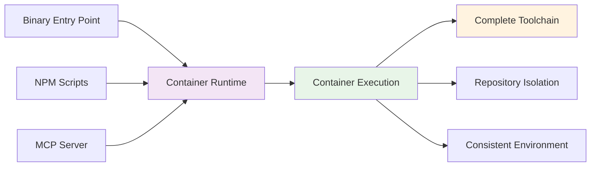
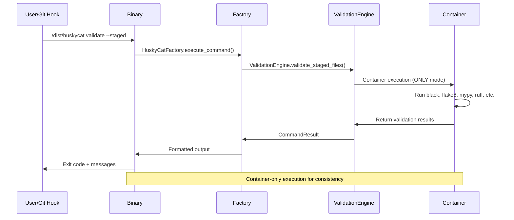

# HuskyCat - Universal Code Validation Platform

A **container-only** validation platform designed for consistent toolchains, repository isolation, and AI integration through MCP server protocol.

## Architecture Overview

HuskyCat enforces container-only execution for all validation operations:



## Key Features

###  **Container-Only Execution**
- Consistent toolchain across all environments
- Complete isolation from host repository
- No "tool not found" errors - ever

###  **Repository Safety & Isolation**
- Binary configs stored separately from repository
- Validation tools cannot interfere with actual files
- Read-only repository mounting for security

###  **AI Integration via MCP**
- stdio-based MCP server for Claude Code
- Container-backed validation tools as AI-callable functions
- Real-time code quality feedback with full toolchain

###  **Universal Validation with Auto-Fix**
- **Core Tools**: Black, Flake8, MyPy, Ruff
- **Extended Tools**: yamllint, shellcheck, hadolint, eslint
- **Security**: bandit, safety, dependency scanning
- **GitLab CI**: Schema validation and pipeline testing
- **Auto-Fix**: Interactive prompts for automatic issue resolution

## Quick Start

### 1. Prerequisites & Setup
```bash
# Required: Container runtime (podman or docker)
# Install podman: brew install podman (macOS) or apt install podman (Ubuntu)

# Install dependencies
npm install
uv sync --dev

# Build container (required for all validation)
npm run container:build

# Build binary entry point
npm run build:binary

# Verify installation
./dist/huskycat --version
./dist/huskycat status
```

### 2. Core Operations
```bash
# Fast binary execution (git hooks, production)
./dist/huskycat validate --staged    # Validate staged files
./dist/huskycat setup-hooks          # Install git hooks
./dist/huskycat ci-validate .gitlab-ci.yml

# Auto-fix validation (NEW)
./dist/huskycat validate --fix       # Auto-fix validation issues
git addf <files>                     # Interactive auto-fix before staging
git addf .                          # Validate and auto-fix all files

# Development mode (NPM scripts)
npm run validate                     # Quick validation
npm run validate:ci                  # CI configuration
npm run mcp:server                   # Start MCP server

# Container mode (comprehensive)
npm run container:test:validate      # Full toolchain
```

### 3. Claude Code Integration
```bash
# Start MCP server (stdio protocol)
./dist/huskycat mcp-server

# Test connection
echo '{"jsonrpc": "2.0", "method": "tools/list", "id": 1}' | npm run mcp:server
```

## Execution Modes

All execution modes use **container-only validation** for consistency:

###  Binary Entry Point (Recommended)
```bash
./dist/huskycat [command]            # Fast startup, container execution
```
**Best for**: Git hooks, CI/CD, production deployments

###  NPM Script Development
```bash
npm run dev -- [command]            # Python module via NPM
```
**Best for**: Development, testing, convenience

###  MCP Server Mode
```bash
./dist/huskycat mcp-server           # stdio JSON-RPC server
```
**Best for**: Claude Code integration, AI-powered validation

**All modes provide**: Complete toolchain (Python + Node.js + Shell + Docker + Security) via container execution

## Available Commands

| Command | Description | Options |
|---------|-------------|---------|
| `validate` | Run validation on files | `--staged`, `--all`, `[files...]` |
| `install` | Install HuskyCat and dependencies | `--dev`, `--global` |
| `setup-hooks` | Setup git hooks for automatic validation | `--force` |
| `update-schemas` | Update validation schemas from official sources | `--force` |
| `ci-validate` | Validate CI configuration files | `[files...]` |
| `auto-devops` | Validate Auto-DevOps Helm charts and Kubernetes | `--no-helm`, `--no-k8s`, `--simulate`, `--strict` |
| `mcp-server` | Start MCP server for AI integration | `--port PORT` |
| `clean` | Clean cache and temporary files | `--all` |
| `status` | Show HuskyCat status and configuration | |

## Requirements

### Core Requirements
- **Container Runtime**: Podman or Docker (required)
- **Python 3.8+**: For binary build and NPM mode
- **UV package manager**: `pip install uv`
- **Node.js and npm**: Build system

### Optional Requirements  
- **PyInstaller + UPX**: Binary compression
- **Git**: For hooks and staged file validation

### Tool Availability
| Component | Tools Available |
|-----------|----------------|
| **Container** |  Complete toolchain (Python + Node.js + Shell + Docker + Security) |
| **Binary Entry Point** |  Fast startup, delegates to container |
| **Repository** |  Read-only, isolated from validation tools |

## Installation

1. **Clone and build**:
   ```bash
   git clone <repository>
   cd huskycats-bates
   npm install
   npm run build:binary
   ```

2. **Install Python dependencies**:
   ```bash
   uv sync --dev
   ```

3. **Verify installation**:
   ```bash
   ./dist/huskycat --version
   ./dist/huskycat status
   ```

## Architecture Deep Dive

### Container-Only Execution Flow
HuskyCat enforces container-only validation for consistency and isolation:

```python
# All commands flow through HuskyCatFactory -> Container
factory = HuskyCatFactory(config_dir=~/.huskycat)
result = factory.execute_command("validate", files=["src/"])
# Automatically routes to container execution
```

### Repository Safety & Binary Isolation
- **Binary**: Lightweight entry point, configs stored in ~/.huskycat
- **Container**: Complete toolchain, repository mounted read-only
- **ValidationEngine**: Container-only execution, no local tool dependencies
- **Safety**: Tools cannot modify repository files directly

### MCP Server Protocol
Uses stdio-based JSON-RPC 2.0 for Claude Code integration:
```json
{"jsonrpc": "2.0", "method": "tools/call", "params": {
  "name": "validate", 
  "arguments": {"path": "src/", "fix": false}
}}
```

### Performance Characteristics
- **Binary Entry Point**: ~100ms startup, delegates to container
- **NPM Scripts**: ~200ms startup (Python import overhead), delegates to container
- **Container Execution**: ~1-3s per validation (comprehensive tooling)
- **MCP Server**: Persistent process, container-backed responses

## Implementation Details

### Critical Files for Container-Only Architecture:
- `src/huskycat/__main__.py` - CLI entry point (binary-first)
- `src/huskycat/core/factory.py` - Unified command factory
- `src/huskycat/unified_validation.py` - Container-only validation engine
- `src/huskycat/mcp_server.py` - MCP stdio server with container backend
- `ContainerFile` - Complete toolchain container definition

### Current Status:
 **Container-Only Execution**: All validators use container execution  
 **Repository Isolation**: Read-only mounting, binary config separation  
 **Test Suite**: Some property-based tests have import issues  
 **Validation Strictness**: MyPy errors block git push (use --no-verify temporarily)  

## Documentation

Visit [huskycat.pages.io](https://huskycat.pages.io) for complete documentation.

**For Developers**: See `/Users/jsullivan2/git/huskycats-bates/CLAUDE.md` for detailed architecture notes and `/Users/jsullivan2/git/huskycats-bates/ARCHITECTURE_GAPS.md` for implementation gap analysis.

## Quick Architecture Reference

