# HuskyCat Universal Code Validation Platform

Welcome to HuskyCat, the **Universal Code Validation Platform** with integrated **MCP (Model Context Protocol) Server** support for seamless Claude Code integration.

## What is HuskyCat?

HuskyCat is a **container-based** validation platform designed for consistent toolchains, repository isolation, and AI integration:

- **Container-Based Execution**: Automatic container detection with toolchain consistency across all environments
- **Pre-Built Binaries**: Download and run immediately on Linux (AMD64/ARM64) and macOS (Apple Silicon)
- **Repository Safety**: Validation tools run in isolation from your actual repository
- **MCP Server Integration**: stdio-based server for seamless Claude Code integration
- **Git Hooks**: Fast validation with automatic container orchestration
- **Universal Validation**: Python, JavaScript, YAML, Shell, Docker, security scanning
- **Auto-Fix Support**: Interactive auto-repair of validation issues

## Quick Start

### Option 1: Pre-Built Binary (Fastest)

```bash
# Download for your platform (Linux AMD64 example)
curl -L -o ~/.local/bin/huskycat https://gitlab.com/tinyland/ai/huskycat/-/releases/permalink/latest/downloads/huskycat-linux-amd64
chmod +x ~/.local/bin/huskycat

# Install container runtime (required)
brew install podman  # macOS
# or: sudo dnf install podman  # Rocky Linux

# Verify installation
huskycat --version
huskycat status
```

See **[Binary Downloads](binary-downloads.md)** for all platforms and detailed instructions.

### Option 2: Build from Source

```bash
# Clone repository
git clone https://gitlab.com/tinyland/ai/huskycat.git
cd huskycat

# Install dependencies
npm install
uv sync --dev

# Build binary
npm run build:binary

# Verify
./dist/huskycat --version
```

## Key Features

### 🐳 **Container-Based Execution**
- Automatic detection: containers on host, direct execution in CI
- Consistent toolchain across all environments
- Complete isolation from host repository
- No "tool not found" errors - ever

### 🔒 **Repository Safety & Isolation**
- Binary configs stored separately from repository
- Validation tools cannot interfere with actual files
- Read-only repository mounting for security

### 🤖 **AI Integration via MCP**
- stdio-based MCP server for Claude Code
- Container-backed validation tools as AI-callable functions
- Real-time code quality feedback with full toolchain

### 🔄 **Universal Validation with Auto-Fix**
- **Python**: Black, Ruff, IsSort, Flake8, MyPy, Autoflake
- **JavaScript/TypeScript**: Prettier, ESLint
- **Web**: HTML, CSS, Markdown (Prettier)
- **Data Formats**: JSON, YAML, TOML (yamllint, taplo)
- **Infrastructure-as-Code**: Ansible (ansible-lint), Terraform (terraform fmt)
- **Specialized**: Chapel (custom formatter), Shell (shellcheck), Docker (hadolint)
- **Security**: bandit, safety, dependency scanning
- **GitLab CI**: Schema validation and pipeline testing
- **Auto-Fix**: 10 validators with interactive auto-repair (95% language coverage)

## Architecture

HuskyCat uses container-based execution with automatic environment detection:

```mermaid
graph LR
    A["🚀 Binary Entry Point"] --> B["Container Runtime"]
    C["🛠️ NPM Scripts"] --> B
    D["🤖 MCP Server"] --> B
    
    B --> E["🐳 Container Execution"]
    E --> F["Complete Toolchain"]
    E --> G["Repository Isolation"] 
    E --> H["Consistent Environment"]
    
    style B fill:#f3e5f5
    style E fill:#e8f5e8
    style F fill:#fff3e0
```



## Getting Started

Choose your installation method:

All execution modes use **container-only validation** for consistency:

=== "🚀 Binary Entry Point (Recommended)"

    ```bash
    ./dist/huskycat [command]            # Fast startup, container execution
    ```
    **Best for**: Git hooks, CI/CD, production deployments

=== "🛠️ NPM Script Development"

    ```bash
    npm run dev -- [command]            # Python module via NPM
    ```
    **Best for**: Development, testing, convenience

=== "🤖 MCP Server Mode"

    ```bash
    ./dist/huskycat mcp-server           # stdio JSON-RPC server
    ```
    **Best for**: Claude Code integration, AI-powered validation

**All modes provide**: Complete toolchain (Python + Node.js + Shell + Docker + Security) via container execution

## Usage Examples

### Core Operations
```bash
# Fast binary execution (git hooks, production)
./dist/huskycat validate --staged    # Validate staged files
./dist/huskycat setup-hooks          # Install git hooks
./dist/huskycat ci-validate .gitlab-ci.yml

# Auto-fix validation (NEW)
./dist/huskycat validate --fix       # Auto-fix validation issues
git addf <files>                     # Interactive auto-fix before staging
git addf .                          # Validate and auto-fix all files

# Development mode (NPM scripts)
npm run validate                     # Quick validation
npm run validate:ci                  # CI configuration
npm run mcp:server                   # Start MCP server

# Container mode (comprehensive)
npm run container:test:validate      # Full toolchain
```

### Claude Code Integration
```bash
# Start MCP server (stdio protocol)
./dist/huskycat mcp-server

# Test connection
echo '{"jsonrpc": "2.0", "method": "tools/list", "id": 1}' | npm run mcp:server
```

## Next Steps

### Getting Started
- **[Binary Downloads](binary-downloads.md)** - Download pre-built binaries (recommended)
- **[Installation Guide](installation.md)** - Build from source and setup
- **[CLI Reference](cli-reference.md)** - Complete command reference

### Integration
- **[GitLab CI/CD](gitlab-ci-cd.md)** - GitLab pipeline integration
- **[GitHub Actions](github-actions.md)** - GitHub workflow integration
- **[MCP Server](features/mcp-server.md)** - Claude Code integration

### Reference
- **[Configuration](configuration.md)** - Customize validation rules
- **[MCP Tools API](api/mcp-tools.md)** - MCP server tools reference
- **[Troubleshooting](troubleshooting.md)** - Common issues and solutions

## For AI Agents & LLMs

HuskyCat documentation is available in LLM-friendly formats for easy ingestion by AI agents:

- **llms.txt**: [https://tinyland.gitlab.io/ai/huskycat/llms.txt](https://tinyland.gitlab.io/ai/huskycat/llms.txt) - Plain text format
- **llms.json**: [https://tinyland.gitlab.io/ai/huskycat/llms.json](https://tinyland.gitlab.io/ai/huskycat/llms.json) - Structured JSON
- **llms-full.md**: [https://tinyland.gitlab.io/ai/huskycat/llms-full.md](https://tinyland.gitlab.io/ai/huskycat/llms-full.md) - Single markdown file

These files are automatically generated from the documentation source and updated with every commit to main.

## Support

- **Documentation**: [https://huskycat.pages.io](https://huskycat.pages.io)
- **Issues**: [GitLab Issues](https://gitlab.com/tinyland/ai/huskycat/-/issues)
- **Discussions**: [GitLab Discussions](https://gitlab.com/tinyland/ai/huskycat/-/issues)

---

**HuskyCat** - Making code validation universal, fast, and intelligent.