# HuskyCat Documentation Documentation
> Universal Code Validation Platform

**Last Updated**: 2025-12-05 21:52:10 UTC
**Version**: 6d0ff6a
**Source**: https://gitlab.com/tinyland/ai/huskycat

---

# Table of Contents

- [Home](#home)
- [Installation](#installation)
- [Binary Downloads](#binary-downloads)
- [Configuration](#configuration)
- [CLI Reference](#cli-reference)
- [GitLab CI/CD](#gitlab-ci-cd)
- [GitHub Actions](#github-actions)
- [Auto-DevOps](#auto-devops)
- [MCP Server](#mcp-server)
- [MCP Tools](#mcp-tools)
- [Troubleshooting](#troubleshooting)

---

<div id="home"></div>

# HuskyCat Universal Code Validation Platform

Welcome to HuskyCat, the **Universal Code Validation Platform** with integrated **MCP (Model Context Protocol) Server** support for seamless Claude Code integration.

## What is HuskyCat?

HuskyCat is a **container-based** validation platform designed for consistent toolchains, repository isolation, and AI integration:

- **Container-Based Execution**: Automatic container detection with toolchain consistency across all environments
- **Pre-Built Binaries**: Download and run immediately on Linux (AMD64/ARM64) and macOS (Apple Silicon)
- **Repository Safety**: Validation tools run in isolation from your actual repository
- **MCP Server Integration**: stdio-based server for seamless Claude Code integration
- **Git Hooks**: Fast validation with automatic container orchestration
- **Universal Validation**: Python, JavaScript, YAML, Shell, Docker, security scanning
- **Auto-Fix Support**: Interactive auto-repair of validation issues

## Quick Start

### Option 1: Pre-Built Binary (Fastest)

```bash
# Download for your platform (Linux AMD64 example)
curl -L -o ~/.local/bin/huskycat https://gitlab.com/tinyland/ai/huskycat/-/releases/permalink/latest/downloads/huskycat-linux-amd64
chmod +x ~/.local/bin/huskycat

# Install container runtime (required)
brew install podman  # macOS
# or: sudo dnf install podman  # Rocky Linux

# Verify installation
huskycat --version
huskycat status
```

See **[Binary Downloads](binary-downloads.md)** for all platforms and detailed instructions.

### Option 2: Build from Source

```bash
# Clone repository
git clone https://gitlab.com/tinyland/ai/huskycat.git
cd huskycat

# Install dependencies
npm install
uv sync --dev

# Build binary
npm run build:binary

# Verify
./dist/huskycat --version
```

## Key Features

### 🐳 **Container-Based Execution**
- Automatic detection: containers on host, direct execution in CI
- Consistent toolchain across all environments
- Complete isolation from host repository
- No "tool not found" errors - ever

### 🔒 **Repository Safety & Isolation**
- Binary configs stored separately from repository
- Validation tools cannot interfere with actual files
- Read-only repository mounting for security

### 🤖 **AI Integration via MCP**
- stdio-based MCP server for Claude Code
- Container-backed validation tools as AI-callable functions
- Real-time code quality feedback with full toolchain

### 🔄 **Universal Validation with Auto-Fix**
- **Core Tools**: Black, Flake8, MyPy, Ruff
- **Extended Tools**: yamllint, shellcheck, hadolint, eslint
- **Security**: bandit, safety, dependency scanning
- **GitLab CI**: Schema validation and pipeline testing
- **Auto-Fix**: Interactive prompts for automatic issue resolution

## Architecture

HuskyCat uses container-based execution with automatic environment detection:

```mermaid
graph LR
    A["🚀 Binary Entry Point"] --> B["Container Runtime"]
    C["🛠️ NPM Scripts"] --> B
    D["🤖 MCP Server"] --> B
    
    B --> E["🐳 Container Execution"]
    E --> F["Complete Toolchain"]
    E --> G["Repository Isolation"] 
    E --> H["Consistent Environment"]
    
    style B fill:#f3e5f5
    style E fill:#e8f5e8
    style F fill:#fff3e0
```



## Getting Started

Choose your installation method:

All execution modes use **container-only validation** for consistency:

=== "🚀 Binary Entry Point (Recommended)"

    ```bash
    ./dist/huskycat [command]            # Fast startup, container execution
    ```
    **Best for**: Git hooks, CI/CD, production deployments

=== "🛠️ NPM Script Development"

    ```bash
    npm run dev -- [command]            # Python module via NPM
    ```
    **Best for**: Development, testing, convenience

=== "🤖 MCP Server Mode"

    ```bash
    ./dist/huskycat mcp-server           # stdio JSON-RPC server
    ```
    **Best for**: Claude Code integration, AI-powered validation

**All modes provide**: Complete toolchain (Python + Node.js + Shell + Docker + Security) via container execution

## Usage Examples

### Core Operations
```bash
# Fast binary execution (git hooks, production)
./dist/huskycat validate --staged    # Validate staged files
./dist/huskycat setup-hooks          # Install git hooks
./dist/huskycat ci-validate .gitlab-ci.yml

# Auto-fix validation (NEW)
./dist/huskycat validate --fix       # Auto-fix validation issues
git addf <files>                     # Interactive auto-fix before staging
git addf .                          # Validate and auto-fix all files

# Development mode (NPM scripts)
npm run validate                     # Quick validation
npm run validate:ci                  # CI configuration
npm run mcp:server                   # Start MCP server

# Container mode (comprehensive)
npm run container:test:validate      # Full toolchain
```

### Claude Code Integration
```bash
# Start MCP server (stdio protocol)
./dist/huskycat mcp-server

# Test connection
echo '{"jsonrpc": "2.0", "method": "tools/list", "id": 1}' | npm run mcp:server
```

## Next Steps

### Getting Started
- **[Binary Downloads](binary-downloads.md)** - Download pre-built binaries (recommended)
- **[Installation Guide](installation.md)** - Build from source and setup
- **[CLI Reference](cli-reference.md)** - Complete command reference

### Integration
- **[GitLab CI/CD](gitlab-ci-cd.md)** - GitLab pipeline integration
- **[GitHub Actions](github-actions.md)** - GitHub workflow integration
- **[MCP Server](features/mcp-server.md)** - Claude Code integration

### Reference
- **[Configuration](configuration.md)** - Customize validation rules
- **[MCP Tools API](api/mcp-tools.md)** - MCP server tools reference
- **[Troubleshooting](troubleshooting.md)** - Common issues and solutions

## For AI Agents & LLMs

HuskyCat documentation is available in LLM-friendly formats for easy ingestion by AI agents:

- **llms.txt**: [https://tinyland.gitlab.io/ai/huskycat/llms.txt](https://tinyland.gitlab.io/ai/huskycat/llms.txt) - Plain text format
- **llms.json**: [https://tinyland.gitlab.io/ai/huskycat/llms.json](https://tinyland.gitlab.io/ai/huskycat/llms.json) - Structured JSON
- **llms-full.md**: [https://tinyland.gitlab.io/ai/huskycat/llms-full.md](https://tinyland.gitlab.io/ai/huskycat/llms-full.md) - Single markdown file

These files are automatically generated from the documentation source and updated with every commit to main.

## Support

- **Documentation**: [https://huskycat.pages.io](https://huskycat.pages.io)
- **Issues**: [GitLab Issues](https://gitlab.com/tinyland/ai/huskycat/-/issues)
- **Discussions**: [GitLab Discussions](https://gitlab.com/tinyland/ai/huskycat/-/issues)

---

**HuskyCat** - Making code validation universal, fast, and intelligent.

---

<div id="installation"></div>

# Installation Guide

This guide covers installing HuskyCat locally and in development projects.

## 🚀 Quick Start: Pre-Built Binaries (Recommended)

The fastest way to get started is using pre-built binaries from GitLab releases.

### Download and Install

**Linux (AMD64):**
```bash
curl -L -o ~/.local/bin/huskycat https://gitlab.com/tinyland/ai/huskycat/-/releases/permalink/latest/downloads/huskycat-linux-amd64
chmod +x ~/.local/bin/huskycat
```

**Linux (ARM64):**
```bash
curl -L -o ~/.local/bin/huskycat https://gitlab.com/tinyland/ai/huskycat/-/releases/permalink/latest/downloads/huskycat-linux-arm64
chmod +x ~/.local/bin/huskycat
```

**macOS (Apple Silicon):**
```bash
mkdir -p ~/.local/bin
curl -L -o ~/.local/bin/huskycat https://gitlab.com/tinyland/ai/huskycat/-/releases/permalink/latest/downloads/huskycat-darwin-arm64
chmod +x ~/.local/bin/huskycat
```

### Verify Installation

```bash
huskycat --version
huskycat status
```

For detailed download instructions, platform-specific notes, and troubleshooting, see **[Binary Downloads Guide](binary-downloads.md)**.

---

## Prerequisites

- **Container Runtime**: Podman or Docker (required for all validation)
- **Python 3.8+**: For binary build and NPM mode
- **UV Package Manager**: `pip install uv`
- **Node.js and npm**: Build system
- **Git Repository**: Required for hooks and staged file validation

## Alternative: Build from Source

For development or platforms without pre-built binaries:

### Build from Source

```bash
# Clone and build HuskyCat
git clone <repository>
cd huskycats-bates
npm install

# Install Python dependencies
uv sync --dev

# Build container (required for all validation)
npm run container:build

# Build binary entry point
npm run build:binary

# Verify installation
./dist/huskycat --version
./dist/huskycat status
```

### Development Mode

```bash
# For active development on HuskyCat itself
npm run dev -- --help             # Show available commands
npm run validate                   # Validate current directory
npm run hooks:install              # Setup git hooks
npm run mcp:server                 # Start MCP server
```

## Using HuskyCat in Your Projects

### 1. Setup Git Hooks

```bash
# Navigate to your project
cd your-project

# Setup HuskyCat git hooks
./path/to/huskycat setup-hooks

# Test the installation
git add .
git commit -m "test: verify hooks"  # Should run validation
```

### 2. Validate Code

```bash
# Validate current directory
./path/to/huskycat validate

# Validate specific files
./path/to/huskycat validate src/main.py

# Validate all files
./path/to/huskycat validate --all

# Validate only staged files
./path/to/huskycat validate --staged
```

## MCP Server Integration

### Setup MCP for Claude Code

```bash
# Start MCP server for Claude Code integration (stdio mode)
./path/to/huskycat mcp-server

# Or use the bootstrap command for automatic setup
./path/to/huskycat bootstrap
```

### Claude Code Configuration

Add to your Claude Code MCP configuration file:

```json
{
  "mcpServers": {
    "huskycat": {
      "command": "/path/to/huskycat",
      "args": ["mcp-server"]
    }
  }
}
```

**Note**: HuskyCat MCP server uses stdio protocol only (stdin/stdout). No ports are needed.

### Bootstrap Command

The `bootstrap` command automates MCP configuration setup:

```bash
# Automatically configure Claude Code MCP integration
./dist/huskycat bootstrap

# Force overwrite existing configuration
./dist/huskycat bootstrap --force
```

This command:
1. Creates MCP configuration file with HuskyCat server
2. Configures the correct binary path
3. Sets up stdio transport

## Container-Based Execution

HuskyCat uses containers for all validation to ensure consistency and isolation. The execution mode is automatically detected:

### Automatic Container Detection

**On Host Machine:**
- Requires Podman or Docker installed
- Commands automatically wrapped in container execution
- Tools run in isolated environment

**Inside Container (CI/CD):**
- Detects container environment automatically
- Runs tools directly (no nested containers)
- Optimized for pipeline performance

### Setup

```bash
# Build validation container (required for host execution)
npm run container:build

# Test container works
npm run container:test

# All validation commands use appropriate execution mode
./dist/huskycat validate --all    # Auto-detects: container or direct
npm run validate                  # Auto-detects: container or direct
```

### Container Detection

HuskyCat automatically detects if it's running inside a container by checking:
- `/.dockerenv` file (Docker)
- `container` environment variable (Podman)
- `/run/.containerenv` file (Podman)

If no container runtime is detected on the host, HuskyCat will show an error and installation instructions for Podman or Docker.

## What Gets Configured

HuskyCat setup creates:

```
your-project/
├── .git/hooks/               # Git hooks installed by setup-hooks
│   ├── pre-commit           # Validates staged files
│   ├── pre-push             # Validates CI configuration  
│   └── commit-msg           # Validates commit message format
├── .huskycat/               # Configuration and cache
│   ├── config.json         # HuskyCat configuration
│   └── schemas/            # Downloaded validation schemas
└── (existing project files remain unchanged)
```

## Post-Installation

### Verify Installation

```bash
# Check HuskyCat status
./dist/huskycat status

# Test validation
./dist/huskycat validate --all

# Verify git hooks are working
git add .
git commit -m "test: verify hooks"  # Should run validation

# Update validation schemas
./dist/huskycat update-schemas
```

### Using HuskyCat Commands

After installation, you can use these commands:

```bash
# Validate code
./dist/huskycat validate                    # Validate current directory
./dist/huskycat validate --staged          # Validate staged files
./dist/huskycat validate src/main.py       # Validate specific file

# CI/CD validation  
./dist/huskycat ci-validate .gitlab-ci.yml # Validate GitLab CI

# MCP integration
./dist/huskycat mcp-server                  # Start MCP server

# Management
./dist/huskycat clean                       # Clean cache
./dist/huskycat update-schemas              # Update schemas
./dist/huskycat status                      # Show status
```

## Development Configuration

### Configure Your IDE

#### VS Code
Add to `.vscode/settings.json`:
```json
{
  "editor.formatOnSave": true,
  "python.formatting.provider": "black",
  "python.linting.enabled": true,
  "python.linting.flake8Enabled": true,
  "[python]": {
    "editor.codeActionsOnSave": {
      "source.organizeImports": true
    }
  }
}
```

#### PyCharm
1. Go to Settings → Tools → File Watchers
2. Add watchers for Black and flake8
3. Enable "Reformat on Save"

### Update package.json Scripts

Add these helpful scripts:
```json
{
  "scripts": {
    "lint": "./scripts/comprehensive-lint.sh --all",
    "lint:fix": "./scripts/comprehensive-lint.sh --all --fix",
    "lint:staged": "./scripts/comprehensive-lint.sh --staged",
    "prepare": "husky install"
  }
}
```

## Troubleshooting

### Architecture Issues

1. **"exec format error" when running Docker**
   ```bash
   # This means architecture mismatch. Use the platform flag:
   docker run --rm --platform linux/amd64 -v "$(pwd):/workspace" \
     registry.gitlab.com/tinyland/ai/huskycat/validator:latest

   # Or build the container locally:
   npm run container:build
   ```

2. **Check your system architecture**
   ```bash
   # See what architecture you're running
   uname -m
   # x86_64 = use linux/amd64
   # arm64 or aarch64 = use linux/arm64
   
   # Check Docker image architecture
   docker inspect registry.gitlab.com/tinyland/ai/huskycat/validator:latest | grep Architecture
   ```

### Common Issues

1. **"command not found" errors**
   - Ensure tools are installed and in PATH
   - Try using full paths in scripts

2. **Permission denied**
   - Make scripts executable: `chmod +x <script>`
   - Check file permissions

3. **Python tools not found**
   - Activate virtual environment
   - Install missing tools with pip

4. **Husky hooks not running**
   - Run `npx husky install`
   - Check Git version (needs 2.9+)
   - Ensure core.hooksPath is not set

For additional support, see our [GitLab Issues](https://gitlab.com/tinyland/ai/huskycat/-/issues) page.

---

<div id="binary-downloads"></div>

# Binary Downloads

HuskyCat provides pre-built binaries for multiple platforms through GitLab releases.

## Quick Install

### Linux (AMD64)

```bash
# Download latest release
curl -L -o huskycat https://gitlab.com/tinyland/ai/huskycat/-/releases/permalink/latest/downloads/huskycat-linux-amd64

# Make executable
chmod +x huskycat

# Install to system path (optional)
sudo mv huskycat /usr/local/bin/
```

### Linux (ARM64)

```bash
# Download latest release
curl -L -o huskycat https://gitlab.com/tinyland/ai/huskycat/-/releases/permalink/latest/downloads/huskycat-linux-arm64

# Make executable
chmod +x huskycat

# Install to system path (optional)
sudo mv huskycat /usr/local/bin/
```

### macOS (Apple Silicon)

```bash
# Download latest release (ad-hoc signed)
curl -L -o huskycat https://gitlab.com/tinyland/ai/huskycat/-/releases/permalink/latest/downloads/huskycat-darwin-arm64

# Make executable
chmod +x huskycat

# Install to user path (recommended for unsigned binaries)
mv huskycat ~/.local/bin/

# Add to PATH if needed
echo 'export PATH="$HOME/.local/bin:$PATH"' >> ~/.zshrc
source ~/.zshrc
```

**Note**: macOS binaries are ad-hoc signed. You may need to allow execution in System Settings > Privacy & Security on first run.

## Available Binaries

| Platform | Architecture | Binary Name | Status |
|----------|-------------|-------------|---------|
| Linux | x86_64 | `huskycat-linux-amd64` | ✅ Rocky Linux 10 |
| Linux | ARM64/aarch64 | `huskycat-linux-arm64` | ✅ Rocky Linux 10 |
| macOS | Apple Silicon (M1/M2/M3) | `huskycat-darwin-arm64` | ✅ Ad-hoc signed |
| macOS | Intel (x86_64) | ❌ Not available | GitLab SaaS ARM64 only |

## Download Options

### Option 1: Latest Release (Recommended)

Use GitLab's permalink to always get the latest version:

```bash
# Linux AMD64
https://gitlab.com/tinyland/ai/huskycat/-/releases/permalink/latest/downloads/huskycat-linux-amd64

# Linux ARM64
https://gitlab.com/tinyland/ai/huskycat/-/releases/permalink/latest/downloads/huskycat-linux-arm64

# macOS ARM64
https://gitlab.com/tinyland/ai/huskycat/-/releases/permalink/latest/downloads/huskycat-darwin-arm64
```

### Option 2: Specific Version

Download a specific tagged release:

```bash
# Replace $VERSION with desired tag (e.g., v2.0.0)
https://gitlab.com/tinyland/ai/huskycat/-/jobs/artifacts/$VERSION/raw/dist/bin/huskycat-linux-amd64?job=binary:build:linux
```

### Option 3: Browse All Releases

Visit the releases page to see all available versions:

[https://gitlab.com/tinyland/ai/huskycat/-/releases](https://gitlab.com/tinyland/ai/huskycat/-/releases)

## Verification

### Check Version

```bash
./huskycat --version
```

### Verify Installation

```bash
# Show system status
./huskycat status

# Test validation
./huskycat validate --help
```

### Container Requirements

HuskyCat requires a container runtime for validation:

```bash
# Check for Podman
podman --version

# Or check for Docker
docker --version
```

If neither is installed, see [Container Runtime Installation](#container-runtime-installation).

## Installation Methods

### Method 1: User Installation (Recommended)

Install to `~/.local/bin` (no sudo required):

```bash
# Create directory if it doesn't exist
mkdir -p ~/.local/bin

# Download and install
curl -L -o ~/.local/bin/huskycat https://gitlab.com/tinyland/ai/huskycat/-/releases/permalink/latest/downloads/huskycat-linux-amd64
chmod +x ~/.local/bin/huskycat

# Add to PATH (if not already)
echo 'export PATH="$HOME/.local/bin:$PATH"' >> ~/.bashrc
source ~/.bashrc
```

### Method 2: System-Wide Installation

Install to `/usr/local/bin` (requires sudo):

```bash
# Download
curl -L -o /tmp/huskycat https://gitlab.com/tinyland/ai/huskycat/-/releases/permalink/latest/downloads/huskycat-linux-amd64

# Install
sudo install -m 0755 /tmp/huskycat /usr/local/bin/huskycat
rm /tmp/huskycat
```

### Method 3: Project-Local Installation

Install in your project directory:

```bash
# Download to project
curl -L -o huskycat https://gitlab.com/tinyland/ai/huskycat/-/releases/permalink/latest/downloads/huskycat-linux-amd64
chmod +x huskycat

# Use relative path
./huskycat setup-hooks
./huskycat validate
```

## Container Runtime Installation

HuskyCat requires either Podman or Docker for validation.

### Podman (Recommended)

#### macOS

```bash
# Using Homebrew
brew install podman

# Start Podman machine
podman machine init
podman machine start
```

#### Linux

```bash
# Ubuntu/Debian
sudo apt-get update
sudo apt-get install -y podman

# Fedora/Rocky/RHEL
sudo dnf install -y podman

# Arch
sudo pacman -S podman
```

### Docker

#### macOS

Download Docker Desktop from [https://www.docker.com/products/docker-desktop](https://www.docker.com/products/docker-desktop)

#### Linux

```bash
# Ubuntu/Debian
curl -fsSL https://get.docker.com -o get-docker.sh
sudo sh get-docker.sh

# Add user to docker group (optional)
sudo usermod -aG docker $USER
newgrp docker
```

## Post-Installation

### 1. Setup Git Hooks

```bash
# Navigate to your project
cd your-project

# Install HuskyCat git hooks
huskycat setup-hooks
```

### 2. Configure MCP (Optional)

For Claude Code integration:

```bash
huskycat bootstrap
```

See [MCP Server Integration](features/mcp-server.md) for details.

### 3. Build Container (First Run)

```bash
# Build validation container
cd /path/to/huskycats-bates
npm run container:build
```

**Note**: This step is only needed if you're developing HuskyCat itself. For normal usage, the binary will use pre-built container images.

## Troubleshooting

### "Permission denied" on macOS

macOS Gatekeeper may block unsigned binaries:

```bash
# Allow execution
xattr -d com.apple.quarantine ~/.local/bin/huskycat

# Or: System Settings > Privacy & Security > Allow "huskycat"
```

### "No container runtime available"

Install Podman or Docker:

```bash
# Check if installed
which podman || which docker

# Install Podman (recommended)
brew install podman  # macOS
sudo dnf install podman  # Rocky Linux
```

### Binary not found after installation

Check PATH:

```bash
# Verify binary location
ls -l ~/.local/bin/huskycat

# Check if directory is in PATH
echo $PATH | grep -q "$HOME/.local/bin" && echo "✓ In PATH" || echo "✗ Not in PATH"

# Add to PATH
echo 'export PATH="$HOME/.local/bin:$PATH"' >> ~/.bashrc
source ~/.bashrc
```

### Architecture mismatch

Ensure you downloaded the correct binary for your platform:

```bash
# Check your architecture
uname -m
# x86_64 → Use huskycat-linux-amd64
# aarch64 or arm64 → Use huskycat-linux-arm64 or huskycat-darwin-arm64

# Check binary architecture
file huskycat
```

## Updating

### Manual Update

```bash
# Download new version
curl -L -o /tmp/huskycat https://gitlab.com/tinyland/ai/huskycat/-/releases/permalink/latest/downloads/huskycat-linux-amd64

# Replace existing binary
chmod +x /tmp/huskycat
mv /tmp/huskycat ~/.local/bin/huskycat

# Verify new version
huskycat --version
```

### Update Script

Create an update script:

```bash
#!/usr/bin/env bash
# update-huskycat.sh

set -euo pipefail

PLATFORM="linux-amd64"  # Change to your platform
INSTALL_DIR="$HOME/.local/bin"
BINARY_URL="https://gitlab.com/tinyland/ai/huskycat/-/releases/permalink/latest/downloads/huskycat-${PLATFORM}"

echo "Downloading HuskyCat for ${PLATFORM}..."
curl -L -o /tmp/huskycat "$BINARY_URL"

echo "Installing to ${INSTALL_DIR}..."
chmod +x /tmp/huskycat
mv /tmp/huskycat "${INSTALL_DIR}/huskycat"

echo "✓ HuskyCat updated successfully!"
huskycat --version
```

```bash
# Make executable and run
chmod +x update-huskycat.sh
./update-huskycat.sh
```

## Alternative: Build from Source

If binaries aren't available for your platform, build from source:

```bash
git clone https://gitlab.com/tinyland/ai/huskycat.git
cd huskycat
npm install
uv sync --dev
npm run build:binary

# Binary will be at: dist/huskycat
```

See [Installation Guide](installation.md) for detailed build instructions.

---

For additional support, see [Troubleshooting](troubleshooting.md) or visit our [GitLab Issues](https://gitlab.com/tinyland/ai/huskycat/-/issues).


---

<div id="configuration"></div>

# Configuration Reference

This document details all configuration options for HuskyCat's container-only validation platform.

## Linting Configuration Files

### `.ansible-lint`

Ansible-lint configuration with production-grade settings:

```yaml
# Profile settings
profile: production  # Enforces strict rules

# Paths to exclude
exclude_paths:
  - .cache/
  - node_modules/
  - vendor/

# Behavior
progressive: true   # Return non-zero on warnings
strict: true       # Enable strict mode

# Rule configuration
enable_list:       # Explicitly enabled rules
  - args
  - command-instead-of-module
  - fqcn
  - no-log-password
  # ... more rules

skip_list:         # Rules to skip
  - experimental   # Skip experimental rules
```

### `pyproject.toml`

Python tooling configuration:

```toml
[tool.black]
line-length = 88              # Line length limit
target-version = ['py38']     # Python versions
extend-exclude = '''          # Paths to exclude
  /(
    \.git
    | node_modules
    | vendor
  )/
'''

[tool.isort]
profile = "black"             # Compatible with Black
line_length = 88

[tool.mypy]
python_version = "3.8"
warn_return_any = true
disallow_untyped_defs = true

[tool.ruff]
select = ["E", "F", "I", ...]  # Rule sets to enable
line-length = 88
target-version = "py38"
```

### `.flake8`

Flake8 configuration:

```ini
[flake8]
max-line-length = 88
extend-ignore = E203, W503, E501  # Black compatibility
exclude = 
    .git,
    __pycache__,
    node_modules,
    vendor
per-file-ignores = 
    __init__.py:F401              # Allow unused imports
    test_*.py:F401,F811           # Test-specific ignores
```

### `.lintstagedrc.json`

File-specific linting rules:

```json
{
  "*.{ts,tsx,js,jsx}": [
    "eslint --fix",
    "prettier --write"
  ],
  "*.py": [
    "black",
    "flake8"
  ],
  "*.{yml,yaml}": [
    "prettier --write",
    "ansible-lint check (conditional)"
  ]
}
```

## Script Configuration

### HuskyCat Container Configuration

**Container-Only Execution**: All validation runs in containers with complete toolchains.

Environment variables:
```bash
# Container configuration
HUSKYCAT_CONTAINER_RUNTIME=podman  # or docker
HUSKYCAT_LOG_LEVEL=INFO            # DEBUG, INFO, WARNING, ERROR
HUSKYCAT_CONFIG_DIR=~/.huskycat    # Config storage location

# Validation behavior
HUSKYCAT_AUTO_FIX=false            # Enable auto-fix by default
HUSKYCAT_USE_CACHE=true            # Enable validation caching
```

Command-line options:
```bash
--fix          # Enable auto-fix
--all          # Validate all files
--staged       # Validate only staged files (default)
--verbose, -v  # Verbose output
--mode MODE    # Override auto-detected product mode
--json         # Force JSON output (sets pipeline mode)
```

## Product Modes

HuskyCat operates in 5 distinct product modes, each optimized for different use cases:

### Mode Overview

| Mode | Output Format | Interactive | Auto-Fix | Tools | Use Case |
|------|--------------|-------------|----------|-------|----------|
| `git_hooks` | Minimal | No | SAFE only | Fast subset | Pre-commit/pre-push |
| `ci` | JUnit XML | No | Never | All | Pipeline integration |
| `cli` | Human/Colored | Yes | SAFE+LIKELY | Configured | Interactive terminal |
| `pipeline` | JSON | No | Never | All | Machine-readable |
| `mcp` | JSON-RPC | No | Never | All | AI assistant integration |

### Mode Detection

HuskyCat automatically detects the appropriate mode:

1. **Explicit override**: `--mode git_hooks` or `HUSKYCAT_MODE=ci`
2. **MCP invocation**: `mcp-server` command
3. **CI environment**: `CI=true`, `GITLAB_CI`, `GITHUB_ACTIONS`
4. **Git hooks**: Multiple `GIT_*` environment variables
5. **Pipeline context**: Non-interactive stdin
6. **Default**: CLI mode (interactive terminal)

### Mode-Specific Behavior

#### Git Hooks Mode (`--mode git_hooks`)
- **Output**: Minimal (errors only)
- **Fail-fast**: Yes (stop on first error)
- **Tools**: Fast subset (`python-black`, `ruff`, `mypy`, `flake8`)
- **Auto-fix**: Only SAFE fixes (formatting)

#### CI Mode (`--mode ci`)
- **Output**: JUnit XML for CI artifacts
- **Fail-fast**: No (run all validators)
- **Tools**: All available
- **Auto-fix**: Never (read-only)

#### CLI Mode (`--mode cli`)
- **Output**: Human-readable with colors
- **Interactive**: Yes (prompts for uncertain fixes)
- **Tools**: Configured via `.huskycat.yaml`
- **Auto-fix**: SAFE and LIKELY fixes

#### Pipeline Mode (`--mode pipeline` or `--json`)
- **Output**: JSON for toolchain integration
- **Interactive**: No
- **Tools**: All available
- **Auto-fix**: Never (read-only)

#### MCP Mode (`--mode mcp`)
- **Output**: JSON-RPC 2.0
- **Transport**: stdio (stdin/stdout)
- **Tools**: All available via MCP tools
- **Auto-fix**: Never (Claude decides)

### Auto-Fix Confidence Tiers

HuskyCat uses a three-tier confidence system for auto-fix decisions:

| Tier | Behavior | Example Tools |
|------|----------|---------------|
| **SAFE** | Always safe, formatting only | `python-black`, `js-prettier`, `yamllint` |
| **LIKELY** | Usually safe, style fixes | `autoflake`, `ruff`, `js-eslint` |
| **UNCERTAIN** | Needs human review | Semantic changes |

**Mode-specific auto-fix behavior**:
- **Git Hooks**: Only apply SAFE fixes automatically
- **CLI**: Apply SAFE and LIKELY; prompt for UNCERTAIN
- **CI/Pipeline/MCP**: Never auto-fix (report only)

**File references**:
- Mode detection: `src/huskycat/core/mode_detector.py`
- Adapters: `src/huskycat/core/adapters/*.py`
- FixConfidence: `src/huskycat/core/adapters/base.py:27-51`

### Git Hook Configuration

#### Pre-commit Hook

Container-only validation runs:
1. Staged file validation
2. Auto-fix when requested
3. Complete toolchain in isolated container
4. Repository read-only mounting

**Generated by**: `./dist/huskycat setup-hooks` (do not edit manually)

Customization:
```bash
# Temporary bypass (development only)
git commit --no-verify -m "message"
```

#### Commit-msg Hook

Validates commit format:
```
<type>(<scope>): <subject>

Types: feat, fix, docs, style, refactor, perf, test, build, ci, chore, revert
```

Configuration:
```bash
# Skip issue check
SKIP_ISSUE_CHECK=true git commit
```

#### Pre-push Hook

Runs before push:
- Full linting (all files)
- Affected tests
- Large file detection
- Security scanning

#### Post-merge Hook

Automatic actions after merge:
- Update dependencies
- Run linting on changed files
- Rebuild affected projects

## GitLab CI Configuration

### Basic Structure

```yaml
stages:
  - validate
  - lint
  - test

variables:
  PIP_CACHE_DIR: "$CI_PROJECT_DIR/.cache/pip"
  npm_config_cache: "$CI_PROJECT_DIR/.cache/npm"

cache:
  paths:
    - .cache/pip
    - .cache/npm
    - node_modules/
    - .venv/
```

### Job Templates

Python linting job:
```yaml
lint:python:
  stage: lint
  image: python:3.11
  before_script:
    - pip install black flake8 mypy
  script:
    - black --check .
    - flake8 .
    - mypy .
```

## Container Toolchain

### Available Tools in Container

**Python Tools**:
- black, flake8, mypy, ruff
- bandit, safety (security)
- autoflake, isort (formatting)

**Shell Tools**:
- shellcheck, yamllint, hadolint
- gitlab-ci-local (CI validation)

**JavaScript Tools**:
- eslint, prettier

**All tools** are pre-installed in the container - no local installation needed.

### Adding Custom Validators

Extend the ValidationEngine in `unified_validation.py`:
```python
class CustomValidator(Validator):
    def can_handle(self, file_path: Path) -> bool:
        return file_path.suffix == '.custom'
    
    def validate(self, file_path: Path) -> ValidationResult:
        # Container execution is automatic
        return self._execute_command(['custom-tool', str(file_path)])
```

### Disabling Specific Checks

Per-file basis:
```python
# flake8: noqa
# mypy: ignore-errors
# pylint: disable=all
```

Project-wide:
- Update respective config files
- Modify `skip_list` or `ignore` sections

### Performance & Caching

Container execution optimizations:

1. **Binary-first execution**: Fast startup (~100ms)
2. **Container caching**: Images cached locally
3. **Validation caching**: Results cached in `~/.huskycat/cache`

```bash
# Clean caches
./dist/huskycat clean --all

# Rebuild container
npm run container:build

# Status and performance info
./dist/huskycat status
```


---

<div id="cli-reference"></div>

# CLI Reference

Complete command-line interface reference for HuskyCat.

## Synopsis

```bash
huskycat [OPTIONS] COMMAND [ARGS]
```

## Global Options

| Option | Description |
|--------|-------------|
| `-h`, `--help` | Show help message and exit |
| `--version` | Show version and exit |
| `--verbose`, `-v` | Enable verbose output (repeat for more verbosity) |
| `--config-dir PATH` | Override config directory (default: `.huskycat`) |
| `--mode MODE` | Override product mode detection (see [Product Modes](#product-modes)) |
| `--json` | Force JSON output (equivalent to `--mode pipeline`) |

## Product Modes

HuskyCat automatically detects the execution context, but you can override:

| Mode | Description | Output Format | Use Case |
|------|-------------|---------------|----------|
| `git_hooks` | Git hooks mode | Minimal, errors only | Pre-commit/pre-push validation |
| `ci` | CI/CD mode | JUnit XML | GitLab CI, GitHub Actions |
| `cli` | Interactive CLI | Rich terminal output | Developer usage |
| `pipeline` | Pipeline integration | JSON | Scripting, automation |
| `mcp` | MCP server | JSON-RPC 2.0 | Claude Code integration |

**Examples:**

```bash
# Force CI mode with JUnit XML output
huskycat --mode ci validate --all

# Force JSON output for scripting
huskycat --json status

# Verbose CLI output
huskycat -vv validate src/
```

## Commands

### validate

Validate files or directories with all applicable validators.

**Usage:**
```bash
huskycat validate [OPTIONS] [FILES...]
```

**Arguments:**
- `FILES` - Files or directories to validate (default: current directory)

**Options:**

| Option | Description |
|--------|-------------|
| `--staged` | Validate only staged git files |
| `--all` | Validate all files in repository |
| `--fix` | Auto-fix issues where possible |
| `--interactive` | Prompt for auto-fix decisions |
| `--allow-warnings` | Allow warnings to pass (don't fail) |

**Examples:**

```bash
# Validate current directory
huskycat validate

# Validate specific files
huskycat validate src/main.py tests/test_api.py

# Validate all Python files in src/
huskycat validate src/**/*.py

# Validate staged files (pre-commit)
huskycat validate --staged

# Validate and auto-fix
huskycat validate --fix

# Interactive auto-fix with prompts
huskycat validate --fix --interactive

# Validate all files in repository
huskycat validate --all
```

**Exit Codes:**
- `0` - All validations passed
- `1` - Validation failures found
- `2` - Error during execution

---

### auto-fix

Auto-fix issues using all available validators.

**Usage:**
```bash
huskycat auto-fix [OPTIONS] [FILES...]
```

**Arguments:**
- `FILES` - Files or directories to auto-fix (default: current directory)

**Options:**

| Option | Description |
|--------|-------------|
| `--staged` | Auto-fix only staged git files |
| `--interactive` | Prompt before applying fixes |

**Examples:**

```bash
# Auto-fix current directory
huskycat auto-fix

# Auto-fix staged files
huskycat auto-fix --staged

# Interactive auto-fix with confirmation
huskycat auto-fix --interactive src/
```

---

### setup-hooks

Install git hooks for automatic validation.

**Usage:**
```bash
huskycat setup-hooks [OPTIONS]
```

**Options:**

| Option | Description |
|--------|-------------|
| `--force` | Overwrite existing hooks |

**Examples:**

```bash
# Install git hooks
huskycat setup-hooks

# Force reinstall (overwrite existing)
huskycat setup-hooks --force
```

**Installed Hooks:**
- `pre-commit` - Validates staged files before commit
- `pre-push` - Validates CI configuration before push
- `commit-msg` - Validates commit message format

**Configuration:**

Hooks respect `.huskycat/config.json` settings. To skip hooks temporarily:

```bash
# Skip hooks for one commit
SKIP_HOOKS=1 git commit -m "message"

# Skip validation on push
git push --no-verify
```

---

### ci-validate

Validate CI configuration files.

**Usage:**
```bash
huskycat ci-validate [FILES...]
```

**Arguments:**
- `FILES` - CI configuration files (default: `.gitlab-ci.yml`)

**Examples:**

```bash
# Validate GitLab CI
huskycat ci-validate .gitlab-ci.yml

# Validate multiple CI files
huskycat ci-validate .gitlab-ci.yml .github/workflows/*.yml
```

**Supported CI Configs:**
- GitLab CI (`.gitlab-ci.yml`)
- GitHub Actions (`.github/workflows/*.yml`)

---

### auto-devops

Validate Auto-DevOps Helm charts and Kubernetes manifests.

**Usage:**
```bash
huskycat auto-devops [PATH]
```

**Arguments:**
- `PATH` - Path to Helm charts or K8s manifests (default: `.`)

**Examples:**

```bash
# Validate Auto-DevOps configuration
huskycat auto-devops

# Validate specific Helm chart
huskycat auto-devops charts/myapp/
```

---

### mcp-server

Start MCP server for Claude Code integration (stdio mode).

**Usage:**
```bash
huskycat mcp-server
```

**Notes:**
- Uses stdin/stdout for JSON-RPC 2.0 communication
- No HTTP server or port configuration
- Designed for Claude Code MCP integration

**Examples:**

```bash
# Start MCP server (normally called by Claude Code)
huskycat mcp-server

# Test MCP server manually
echo '{"jsonrpc":"2.0","method":"initialize","params":{},"id":1}' | huskycat mcp-server
```

See [MCP Server Guide](features/mcp-server.md) for integration details.

---

### bootstrap

Automatically configure Claude Code MCP integration.

**Usage:**
```bash
huskycat bootstrap [OPTIONS]
```

**Options:**

| Option | Description |
|--------|-------------|
| `--force` | Overwrite existing MCP configuration |

**Examples:**

```bash
# Configure Claude Code MCP integration
huskycat bootstrap

# Force reconfiguration
huskycat bootstrap --force
```

**What it does:**
1. Creates MCP configuration file
2. Configures HuskyCat binary path
3. Sets up stdio transport

---

### update-schemas

Update validation schemas from official sources.

**Usage:**
```bash
huskycat update-schemas
```

**Examples:**

```bash
# Update all validation schemas
huskycat update-schemas
```

**Updated Schemas:**
- GitLab CI schema
- JSON schemas for configuration files
- Validation rule definitions

---

### clean

Clean cache and temporary files.

**Usage:**
```bash
huskycat clean [OPTIONS]
```

**Options:**

| Option | Description |
|--------|-------------|
| `--all` | Clean all cached data including schemas |

**Examples:**

```bash
# Clean cache and temporary files
huskycat clean

# Clean everything including schemas
huskycat clean --all
```

**Cleaned Directories:**
- `.huskycat/cache/` - Validation cache
- `.huskycat/temp/` - Temporary files
- With `--all`: `.huskycat/schemas/` - Downloaded schemas

---

### status

Show HuskyCat configuration and system status.

**Usage:**
```bash
huskycat status
```

**Examples:**

```bash
# Show status
huskycat status

# JSON output for scripting
huskycat --json status
```

**Status Information:**
- HuskyCat version
- Product mode (detected)
- Container runtime (podman/docker)
- Installed validators
- Git hooks status
- Configuration directory
- Cache size

---

### install

Install HuskyCat binary and dependencies (for development).

**Usage:**
```bash
huskycat install
```

**Examples:**

```bash
# Install HuskyCat
huskycat install
```

**Note:** Most users should use [pre-built binaries](binary-downloads.md) instead.

---

## Environment Variables

HuskyCat respects these environment variables:

| Variable | Description | Default |
|----------|-------------|---------|
| `HUSKYCAT_MODE` | Override product mode detection | Auto-detect |
| `HUSKYCAT_LOG_LEVEL` | Logging level (DEBUG, INFO, WARNING, ERROR) | INFO |
| `HUSKYCAT_CONFIG_DIR` | Configuration directory | `.huskycat` |
| `SKIP_HOOKS` | Skip git hooks (set to `1`) | Not set |
| `CI` | Detected CI environment | Not set |
| `GITLAB_CI` | GitLab CI detection | Not set |
| `GITHUB_ACTIONS` | GitHub Actions detection | Not set |

**Examples:**

```bash
# Enable debug logging
HUSKYCAT_LOG_LEVEL=DEBUG huskycat validate

# Override product mode
HUSKYCAT_MODE=ci huskycat validate --all

# Skip git hooks temporarily
SKIP_HOOKS=1 git commit -m "message"
```

---

## Exit Codes

| Code | Meaning |
|------|---------|
| `0` | Success - all validations passed |
| `1` | Validation failures found |
| `2` | Execution error (invalid arguments, missing dependencies, etc.) |

---

## Configuration Files

### Project Configuration

**Location:** `.huskycat/config.json`

```json
{
  "validators": {
    "python-black": {"enabled": true},
    "mypy": {"enabled": true},
    "flake8": {"enabled": true},
    "ruff": {"enabled": true}
  },
  "auto_fix": {
    "enabled": true,
    "interactive": false
  }
}
```

### Tool-Specific Configuration

HuskyCat respects standard configuration files:

- **Black:** `pyproject.toml` ([tool.black])
- **Flake8:** `.flake8`, `setup.cfg`
- **MyPy:** `mypy.ini`, `pyproject.toml`
- **Ruff:** `ruff.toml`, `pyproject.toml`
- **ESLint:** `.eslintrc.json`, `.eslintrc.js`
- **Prettier:** `.prettierrc`, `prettier.config.js`

---

## Validators

HuskyCat includes these validators:

### Python

| Validator | Tool | Purpose | Auto-Fix |
|-----------|------|---------|----------|
| `python-black` | Black | Code formatting | ✅ Yes |
| `autoflake` | Autoflake | Remove unused imports | ✅ Yes |
| `flake8` | Flake8 | Linting | ❌ No |
| `mypy` | MyPy | Type checking | ❌ No |
| `ruff` | Ruff | Fast linting | ✅ Partial |
| `bandit` | Bandit | Security scanning | ❌ No |

### JavaScript/TypeScript

| Validator | Tool | Purpose | Auto-Fix |
|-----------|------|---------|----------|
| `js-eslint` | ESLint | Linting | ✅ Partial |
| `js-prettier` | Prettier | Code formatting | ✅ Yes |

### Configuration Files

| Validator | Tool | Purpose | Auto-Fix |
|-----------|------|---------|----------|
| `yamllint` | yamllint | YAML linting | ✅ Partial |
| `gitlab-ci` | GitLab CI Lint | CI validation | ❌ No |

### Containers & Scripts

| Validator | Tool | Purpose | Auto-Fix |
|-----------|------|---------|----------|
| `docker-hadolint` | hadolint | Dockerfile linting | ❌ No |
| `shellcheck` | shellcheck | Shell script linting | ❌ No |

---

## Examples

### Common Workflows

**Pre-commit validation:**
```bash
# Validate staged files before commit
huskycat validate --staged --fix
```

**CI/CD integration:**
```bash
# Validate in CI with JUnit XML output
huskycat --mode ci validate --all
```

**Interactive development:**
```bash
# Validate and interactively fix issues
huskycat validate --fix --interactive src/
```

**Scripting/Automation:**
```bash
# Get JSON output for parsing
huskycat --json validate src/ > results.json
```

---

## Troubleshooting

### Common Issues

**"No container runtime available"**

Install Podman or Docker:
```bash
# macOS
brew install podman

# Rocky Linux
sudo dnf install podman
```

**"Permission denied" on macOS**

Allow binary execution:
```bash
xattr -d com.apple.quarantine ~/.local/bin/huskycat
```

**Git hooks not running**

Check hooks installation:
```bash
huskycat status
ls -la .git/hooks/
```

Reinstall if needed:
```bash
huskycat setup-hooks --force
```

---

For detailed installation instructions, see [Installation Guide](installation.md).

For binary downloads, see [Binary Downloads](binary-downloads.md).

For troubleshooting, see [Troubleshooting Guide](troubleshooting.md).


---

<div id="gitlab-ci-cd"></div>

# GitLab CI/CD Integration

HuskyCats Bates provides comprehensive CI/CD validation using the published container image. The container must be built and published manually using podman or docker on your local machine.

## 🚀 Quick Start

### Option 1: Include HuskyCats Template

Add this to your `.gitlab-ci.yml`:

```yaml
include:
  - remote: 'https://gitlab.com/bates-ils/projects/trustees-portal/sid-controller/huskycats-bates/-/raw/main/.gitlab/ci/husky-validation.yml'

stages:
  - test

# This will run comprehensive validation
husky:validate:
  stage: test
```

### Option 2: Custom Configuration

```yaml
image: registry.gitlab.com/tinyland/ai/huskycat/validator:latest

stages:
  - validate
  - lint
  - security
  - test

# Run all validations
validate:all:
  stage: validate
  script:
    - cd /workspace
    - cp -r ${CI_PROJECT_DIR}/* /workspace/
    - ./scripts/comprehensive-lint.sh
```

## 📋 Available Jobs

### Validation Jobs

| Job | Description | Runs On |
|-----|-------------|---------|
| `validate:gitlab-ci` | Validates `.gitlab-ci.yml` syntax | CI file changes |
| `validate:auto-devops` | Validates Auto DevOps configuration | K8s/Helm changes |
| `validate:comprehensive` | Runs all linters and validators | All changes |

### Linting Jobs

| Job | Description | Tools Used |
|-----|-------------|------------|
| `lint:python` | Python code quality | Black, Flake8, MyPy, Ruff, Pylint |
| `lint:javascript` | JS/TS code quality | ESLint, Prettier |
| `lint:shell` | Shell script analysis | ShellCheck |
| `lint:docker` | Dockerfile best practices | Hadolint |
| `lint:yaml` | YAML validation | yamllint |
| `lint:ansible` | Ansible playbook linting | ansible-lint |

### Security Jobs

| Job | Description | Checks For |
|-----|-------------|------------|
| `security:secrets` | Secret scanning | Passwords, API keys, tokens |
| `security:python` | Python security | Bandit, Safety |

### Test Jobs

| Job | Description | Output |
|-----|-------------|--------|
| `test:unit` | Run unit tests | JUnit XML, Coverage |
| `quality:report` | Generate quality metrics | Quality report artifact |

## 🔧 Configuration

### Environment Variables

```yaml
variables:
  # Disable shallow clone for full repo access
  GIT_DEPTH: 0
  
  # Python settings
  PYTHONUNBUFFERED: "1"
  
  # Node settings
  NODE_ENV: "ci"
  
  # Custom linting options
  LINT_PYTHON_BLACK: "true"
  LINT_PYTHON_FLAKE8: "true"
  AUTO_FIX: "false"
```

### Caching

Speed up CI runs with caching:

```yaml
cache:
  key: ${CI_COMMIT_REF_SLUG}
  paths:
    - node_modules/
    - .npm/
    - .cache/
    - .venv/
```

## 🎯 Use Cases

### 1. Python Project

```yaml
include:
  - remote: 'https://gitlab.com/bates-ils/projects/trustees-portal/sid-controller/huskycats-bates/-/raw/main/.gitlab/ci/husky-validation.yml'

stages:
  - lint
  - test

# Python-specific validation
python:quality:
  extends: husky:python
  stage: lint

# Run tests after linting
test:pytest:
  extends: .husky
  stage: test
  script:
    - python -m pytest
```

### 2. Node.js Project

```yaml
image: registry.gitlab.com/tinyland/ai/huskycat/validator:latest

stages:
  - install
  - lint
  - test

install:deps:
  stage: install
  script:
    - npm ci
  cache:
    key: ${CI_COMMIT_REF_SLUG}
    paths:
      - node_modules/

lint:js:
  stage: lint
  script:
    - npx eslint .
    - npx prettier --check .
  needs: ["install:deps"]
```

### 3. Mixed Language Project

```yaml
image: registry.gitlab.com/tinyland/ai/huskycat/validator:latest

stages:
  - validate

# Run all validations
validate:all:
  stage: validate
  before_script:
    - cd /workspace
    - cp -r ${CI_PROJECT_DIR}/* /workspace/
    - cp -r ${CI_PROJECT_DIR}/.* /workspace/ 2>/dev/null || true
  script:
    - ./scripts/comprehensive-lint.sh
  artifacts:
    paths:
      - lint-results.txt
    expire_in: 1 week
```

### 4. Security-Focused Pipeline

```yaml
include:
  - remote: 'https://gitlab.com/bates-ils/projects/trustees-portal/sid-controller/huskycats-bates/-/raw/main/.gitlab/ci/husky-validation.yml'

stages:
  - security

# Fail on security issues
security:scan:
  extends: husky:security
  stage: security
  allow_failure: false
```

## 📊 Artifacts and Reports

### JUnit Test Reports

```yaml
test:results:
  script:
    - python -m pytest --junitxml=test-results.xml
  artifacts:
    reports:
      junit: test-results.xml
```

### Coverage Reports

```yaml
test:coverage:
  script:
    - python -m pytest --cov --cov-report=xml
  coverage: '/TOTAL.*\s+(\d+%)$/'
  artifacts:
    reports:
      coverage_report:
        coverage_format: cobertura
        path: coverage.xml
```

### Quality Reports

```yaml
quality:metrics:
  extends: .husky
  script:
    - ./scripts/comprehensive-lint.sh > quality-report.txt
  artifacts:
    paths:
      - quality-report.txt
    expire_in: 1 month
```

## 🚨 Troubleshooting

### Common Issues

1. **"Docker-in-Docker not available"**
   - Not needed! HuskyCats image includes all tools

2. **"Permission denied" errors**
   - Add execution permissions in before_script:
   ```yaml
   before_script:
     - chmod +x scripts/*.sh
   ```

3. **"Module not found" errors**
   - Install dependencies in the job:
   ```yaml
   script:
     - pip install -r requirements.txt
     - npm install
   ```

### Debugging

Enable verbose output:

```yaml
variables:
  VERBOSE: "true"
  DEBUG: "1"
```

## 🔄 Migration Guide

### From Container Building in CI

Before:
```yaml
services:
  - docker:dind

build:
  script:
    - docker build -t myapp .
```

After:
```yaml
# Build locally with podman/docker:
# ./publish.sh v1.0.0

# Then use in CI:
image: registry.gitlab.com/tinyland/ai/huskycat/validator:latest

validate:
  script:
    - hadolint ContainerFile
    - ./scripts/comprehensive-lint.sh
```

### From Multiple Linter Jobs

Before:
```yaml
flake8:
  image: python:3.9
  script: flake8 .

eslint:
  image: node:16
  script: npx eslint .

shellcheck:
  image: koalaman/shellcheck
  script: shellcheck *.sh
```

After:
```yaml
image: registry.gitlab.com/tinyland/ai/huskycat/validator:latest

lint:all:
  script:
    - ./scripts/comprehensive-lint.sh
```

## 🏗️ Binary Builds

HuskyCat's CI pipeline builds native binaries for multiple platforms using GitLab SaaS runners.

### Supported Platforms

| Platform | Architecture | Base Image | Runner | Status |
|----------|-------------|------------|--------|---------|
| Linux | x86_64 (AMD64) | Rocky Linux 10 | GitLab SaaS AMD64 | ✅ Supported |
| Linux | ARM64 (aarch64) | Rocky Linux 10 | GitLab SaaS ARM64 | ✅ Supported |
| macOS | Apple Silicon (M1/M2/M3) | macOS 14 | GitLab SaaS macOS | ✅ Supported (ad-hoc signed) |
| macOS | Intel (x86_64) | - | - | ❌ Not available |

### Build Configuration

**Linux AMD64:**
```yaml
binary:build:linux:
  stage: package
  image: rockylinux/rockylinux:10
  before_script:
    - dnf install -y epel-release
    - dnf install -y git curl gcc python3 python3-pip zlib-devel upx
    - curl -LsSf https://astral.sh/uv/install.sh | sh
  script:
    - uv sync --extra build
    - uv run pyinstaller --onefile --name huskycat-linux-amd64 huskycat_main.py
    - upx --best --lzma dist/bin/huskycat-linux-amd64
  artifacts:
    paths:
      - dist/bin/huskycat-linux-amd64
```

**Linux ARM64:**
```yaml
binary:build:linux-arm64:
  stage: package
  image: rockylinux/rockylinux:10
  tags:
    - saas-linux-medium-arm64
  before_script:
    - dnf install -y epel-release
    - dnf install -y git curl gcc python3 python3-pip zlib-devel upx
  script:
    - uv sync --extra build
    - uv run pyinstaller --onefile --name huskycat-linux-arm64 huskycat_main.py
```

**macOS ARM64 with Signing:**
```yaml
sign:darwin-arm64:
  extends: .macos_saas_runners
  stage: sign
  script:
    # Create temporary keychain
    - security create-keychain -p "$KEYCHAIN_PASSWORD" "$KEYCHAIN_NAME"
    - security import certificate.p12 -k "$KEYCHAIN_NAME"

    # Check certificate type and sign or fallback
    - |
      APP_CERT_COUNT=$(security find-identity -v "$KEYCHAIN_NAME" | grep -c "Developer ID Application" || true)
      if [ "$APP_CERT_COUNT" -eq 0 ]; then
        codesign --force --sign - dist/bin/huskycat-darwin-arm64  # Ad-hoc signing
      else
        codesign --force --options runtime --sign "$APPLE_DEVELOPER_ID_APPLICATION" dist/bin/huskycat-darwin-arm64
      fi
    - codesign --verify --verbose dist/bin/huskycat-darwin-arm64
```

### Key Features

1. **Rocky Linux 10** - Latest RHEL-compatible base (supported through May 2035)
2. **Native Compilation** - No cross-compilation, native runners for each architecture
3. **UPX Compression** - Reduces binary size by ~60%
4. **macOS Code Signing** - Ad-hoc signing with fallback when Developer ID Application cert not available
5. **Automatic Releases** - Binaries attached to GitLab releases on tags

### Download Binaries

Pre-built binaries are available from GitLab releases:

```bash
# Latest release (permalink)
curl -L -o huskycat https://gitlab.com/tinyland/ai/huskycat/-/releases/permalink/latest/downloads/huskycat-linux-amd64
chmod +x huskycat
```

See [Binary Downloads Guide](binary-downloads.md) for detailed instructions.

---

## 🎉 Benefits

1. **No Container Building in CI** - Uses pre-published images
2. **All Tools Pre-installed** - No setup needed
3. **Consistent Environment** - Same tools locally and in CI
4. **Fast Execution** - No build step required
5. **Comprehensive Validation** - All languages and configs covered
6. **Manual Publishing** - Full control over image versions

## 📚 Next Steps

- [Installation Guide](installation.md) - Setup and install HuskyCat
- [Configuration](configuration.md) - Configure validation rules
- [Auto DevOps](gitlab-auto-devops-complete.md) - Kubernetes validation

---

<div id="github-actions"></div>

# GitHub Actions Integration

Integrate HuskyCat validation into your GitHub Actions workflows for automated code quality checks.

## Quick Start

Add this workflow to `.github/workflows/validate.yml`:

```yaml
name: HuskyCat Validation

on:
  push:
    branches: [ main, develop ]
  pull_request:
    branches: [ main ]

jobs:
  validate:
    runs-on: ubuntu-latest
    steps:
      - uses: actions/checkout@v4

      - name: Download HuskyCat
        run: |
          curl -L -o huskycat https://gitlab.com/tinyland/ai/huskycat/-/releases/permalink/latest/downloads/huskycat-linux-amd64
          chmod +x huskycat
          sudo mv huskycat /usr/local/bin/

      - name: Install Podman
        run: |
          sudo apt-get update
          sudo apt-get install -y podman

      - name: Validate Code
        run: huskycat validate --all
```

## 📋 Workflow Templates

### Basic Validation

Validate all files on push and pull requests:

```yaml
name: Code Validation

on: [push, pull_request]

jobs:
  validate:
    name: Validate Code Quality
    runs-on: ubuntu-latest

    steps:
      - name: Checkout code
        uses: actions/checkout@v4

      - name: Setup HuskyCat
        run: |
          curl -L -o /usr/local/bin/huskycat \
            https://gitlab.com/tinyland/ai/huskycat/-/releases/permalink/latest/downloads/huskycat-linux-amd64
          chmod +x /usr/local/bin/huskycat

      - name: Install Podman
        run: sudo apt-get update && sudo apt-get install -y podman

      - name: Run Validation
        run: huskycat --mode ci validate --all
```

### Python Project Validation

Focused validation for Python projects:

```yaml
name: Python Validation

on:
  push:
    paths:
      - '**.py'
      - 'pyproject.toml'
      - 'setup.py'
      - 'requirements*.txt'

jobs:
  python-validate:
    runs-on: ubuntu-latest

    steps:
      - uses: actions/checkout@v4

      - name: Setup HuskyCat
        run: |
          curl -L -o /usr/local/bin/huskycat \
            https://gitlab.com/tinyland/ai/huskycat/-/releases/permalink/latest/downloads/huskycat-linux-amd64
          chmod +x /usr/local/bin/huskycat

      - name: Install Podman
        run: sudo apt-get install -y podman

      - name: Validate Python Code
        run: |
          huskycat validate --all
          # Validators used: black, flake8, mypy, ruff, bandit
```

### Multi-Platform Validation

Test on multiple platforms:

```yaml
name: Multi-Platform Validation

on: [push, pull_request]

jobs:
  validate:
    strategy:
      matrix:
        os: [ubuntu-latest, macos-latest]
        include:
          - os: ubuntu-latest
            binary: huskycat-linux-amd64
            container: podman
          - os: macos-latest
            binary: huskycat-darwin-arm64
            container: podman

    runs-on: ${{ matrix.os }}

    steps:
      - uses: actions/checkout@v4

      - name: Download HuskyCat
        run: |
          curl -L -o huskycat \
            https://gitlab.com/tinyland/ai/huskycat/-/releases/permalink/latest/downloads/${{ matrix.binary }}
          chmod +x huskycat
          sudo mv huskycat /usr/local/bin/

      - name: Install Container Runtime
        run: |
          if [ "$RUNNER_OS" == "Linux" ]; then
            sudo apt-get update && sudo apt-get install -y podman
          elif [ "$RUNNER_OS" == "macOS" ]; then
            brew install podman
            podman machine init
            podman machine start
          fi

      - name: Validate
        run: huskycat validate --all
```

### Pull Request Validation with Comments

Validate PR changes and comment on results:

```yaml
name: PR Validation

on:
  pull_request:
    types: [opened, synchronize, reopened]

permissions:
  contents: read
  pull-requests: write

jobs:
  validate-pr:
    runs-on: ubuntu-latest

    steps:
      - uses: actions/checkout@v4
        with:
          fetch-depth: 0  # Full history for better diff analysis

      - name: Setup HuskyCat
        run: |
          curl -L -o /usr/local/bin/huskycat \
            https://gitlab.com/tinyland/ai/huskycat/-/releases/permalink/latest/downloads/huskycat-linux-amd64
          chmod +x /usr/local/bin/huskycat

      - name: Install Podman
        run: sudo apt-get install -y podman

      - name: Validate Changed Files
        id: validate
        run: |
          huskycat --json validate --all > validation-results.json
          echo "results<<EOF" >> $GITHUB_OUTPUT
          cat validation-results.json >> $GITHUB_OUTPUT
          echo "EOF" >> $GITHUB_OUTPUT
        continue-on-error: true

      - name: Comment PR
        uses: actions/github-script@v7
        if: always()
        with:
          script: |
            const results = ${{ steps.validate.outputs.results }};
            const comment = `## HuskyCat Validation Results

            ${results.success ? '✅ All validations passed!' : '❌ Validation failures found'}

            **Files validated:** ${results.summary.total_files}
            **Errors:** ${results.summary.total_errors}
            **Warnings:** ${results.summary.total_warnings}
            `;

            github.rest.issues.createComment({
              issue_number: context.issue.number,
              owner: context.repo.owner,
              repo: context.repo.repo,
              body: comment
            });
```

### Scheduled Validation

Run periodic validation checks:

```yaml
name: Scheduled Validation

on:
  schedule:
    - cron: '0 0 * * 0'  # Weekly on Sunday at midnight
  workflow_dispatch:  # Manual trigger

jobs:
  scheduled-validate:
    runs-on: ubuntu-latest

    steps:
      - uses: actions/checkout@v4

      - name: Setup HuskyCat
        run: |
          curl -L -o /usr/local/bin/huskycat \
            https://gitlab.com/tinyland/ai/huskycat/-/releases/permalink/latest/downloads/huskycat-linux-amd64
          chmod +x /usr/local/bin/huskycat

      - name: Install Podman
        run: sudo apt-get install -y podman

      - name: Full Repository Validation
        run: huskycat validate --all --verbose

      - name: Upload Results
        uses: actions/upload-artifact@v4
        if: always()
        with:
          name: validation-results
          path: |
            .huskycat/cache/
            validation-results.json
```

## 🔧 Configuration

### Environment Variables

Set these in workflow or repository secrets:

```yaml
env:
  HUSKYCAT_MODE: ci
  HUSKYCAT_LOG_LEVEL: INFO
```

### Secrets Configuration

For private registries or custom setups:

```yaml
env:
  CONTAINER_REGISTRY_TOKEN: ${{ secrets.CONTAINER_REGISTRY_TOKEN }}
```

## 📊 Status Checks

### Required Status Checks

Add HuskyCat as a required status check:

1. Go to **Settings** → **Branches** → **Branch protection rules**
2. Select your branch (e.g., `main`)
3. Enable **Require status checks to pass before merging**
4. Search for and select **HuskyCat Validation**

### Status Badge

Add a badge to your README:

```markdown
[](https://github.com/your-org/your-repo/actions)
```

## 🚀 Advanced Usage

### Matrix Strategy for Multiple Validators

Run specific validators in parallel:

```yaml
jobs:
  validate:
    strategy:
      matrix:
        validator: [python-black, mypy, flake8, ruff]

    runs-on: ubuntu-latest

    steps:
      - uses: actions/checkout@v4
      - name: Setup HuskyCat
        run: # ... (setup steps)

      - name: Run ${{ matrix.validator }}
        run: huskycat validate --validator ${{ matrix.validator }} --all
```

### Caching

Speed up workflows with caching:

```yaml
- name: Cache HuskyCat Binary
  uses: actions/cache@v4
  with:
    path: /usr/local/bin/huskycat
    key: huskycat-${{ runner.os }}-${{ hashFiles('**/huskycat-version.txt') }}

- name: Cache Validation Schemas
  uses: actions/cache@v4
  with:
    path: .huskycat/schemas/
    key: huskycat-schemas-${{ hashFiles('.huskycat/schemas/**') }}
```

### Auto-Fix and Commit

Automatically fix issues and commit changes:

```yaml
- name: Validate and Auto-Fix
  run: huskycat validate --all --fix

- name: Commit Fixes
  uses: stefanzweifel/git-auto-commit-action@v5
  with:
    commit_message: "fix: auto-fix validation issues [skip ci]"
    file_pattern: "*.py *.js *.ts *.yaml"
```

**⚠️ Warning:** Only use auto-commit on trusted branches or in draft PRs to avoid security risks.

## 🐳 Container-Based Workflow

Use HuskyCat's validation container directly:

```yaml
jobs:
  validate:
    runs-on: ubuntu-latest
    container:
      image: registry.gitlab.com/tinyland/ai/huskycat/validator:latest

    steps:
      - uses: actions/checkout@v4

      - name: Validate
        run: huskycat validate --all
```

## 🔗 Integration with Other Actions

### Combine with Code Coverage

```yaml
- name: Run Tests with Coverage
  run: pytest --cov --cov-report=xml

- name: Validate Code Quality
  run: huskycat validate --all

- name: Upload Coverage
  uses: codecov/codecov-action@v4
```

### Combine with Security Scanning

```yaml
- name: HuskyCat Validation
  run: huskycat validate --all

- name: Run Trivy Security Scan
  uses: aquasecurity/trivy-action@master
  with:
    scan-type: 'fs'
```

## 📈 Performance Tips

1. **Cache Binaries** - Use actions/cache to avoid re-downloading
2. **Parallel Jobs** - Use matrix strategy for independent validations
3. **Conditional Execution** - Use `paths` filter to run only when needed
4. **Container Runtime** - Podman is faster than Docker in most cases

## ❌ Troubleshooting

### Binary Download Fails

```yaml
- name: Download HuskyCat with Retry
  uses: nick-fields/retry@v2
  with:
    timeout_minutes: 5
    max_attempts: 3
    command: |
      curl -L -o /usr/local/bin/huskycat \
        https://gitlab.com/tinyland/ai/huskycat/-/releases/permalink/latest/downloads/huskycat-linux-amd64
      chmod +x /usr/local/bin/huskycat
```

### Podman Installation Issues

```yaml
- name: Install Podman (Fallback to Docker)
  run: |
    if ! command -v podman &> /dev/null; then
      if ! command -v docker &> /dev/null; then
        sudo apt-get update
        sudo apt-get install -y podman
      fi
    fi
```

### Permission Issues on macOS

```yaml
- name: Allow Binary Execution (macOS)
  if: runner.os == 'macOS'
  run: |
    xattr -d com.apple.quarantine /usr/local/bin/huskycat || true
```

## 🔐 Security Considerations

1. **Pin Binary Versions** - Use specific tags instead of `latest`
2. **Verify Checksums** - Download and verify SHA256 checksums
3. **Limit Permissions** - Use minimal required workflow permissions
4. **Review Auto-Commits** - Don't auto-commit on public PRs

Example with version pinning:

```yaml
- name: Download HuskyCat (Pinned Version)
  run: |
    VERSION="v2.0.0"
    curl -L -o /usr/local/bin/huskycat \
      "https://gitlab.com/tinyland/ai/huskycat/-/jobs/artifacts/${VERSION}/raw/dist/bin/huskycat-linux-amd64?job=binary:build:linux"
    chmod +x /usr/local/bin/huskycat
```

## 📚 Examples

Complete workflow examples are available in the [HuskyCat repository](https://gitlab.com/tinyland/ai/huskycat/-/tree/main/.github/workflows).

---

For GitLab CI integration, see [GitLab CI/CD Guide](gitlab-ci-cd.md).

For CLI usage, see [CLI Reference](cli-reference.md).

For binary downloads, see [Binary Downloads](binary-downloads.md).


---

<div id="auto-devops"></div>

# Complete GitLab Auto DevOps Integration Guide for HuskyCats

This comprehensive guide covers integrating HuskyCats Bates with GitLab Auto DevOps for complete CI/CD validation, linting, security scanning, and automated deployments.

## 🚀 Quick Start

### Option 1: Use HuskyCats Container (Recommended)

```yaml
# .gitlab-ci.yml
image: registry.gitlab.com/tinyland/ai/huskycat/validator:latest

variables:
  # Auto DevOps configuration
  CI_APPLICATION_REPOSITORY: $CI_REGISTRY_IMAGE
  CI_APPLICATION_TAG: $CI_COMMIT_SHA
  
  # Disable unnecessary Auto DevOps features
  TEST_DISABLED: 1
  CODE_QUALITY_DISABLED: 1  # We use HuskyCats instead
  CONTAINER_SCANNING_DISABLED: 1  # We use HuskyCats security scanning
  
  # HuskyCats settings
  LINT_AUTO_FIX: "false"
  VERBOSE: "true"

include:
  - template: Auto-DevOps.gitlab-ci.yml

stages:
  - validate
  - build
  - test
  - review
  - deploy

# Override Auto DevOps test with HuskyCats validation
test:
  stage: test
  script:
    - echo "🐱 Running HuskyCats comprehensive validation..."
    - /workspace/scripts/comprehensive-lint.sh
    - /workspace/scripts/auto-devops-validation.sh
    - /workspace/scripts/validate-gitlab-ci-schema.py
  artifacts:
    paths:
      - lint-results.txt
      - validation-report.json
    reports:
      junit: test-results.xml
    expire_in: 1 week
  coverage: '/TOTAL.*\s+(\d+%)$/'
```

### Option 2: Include HuskyCats Template

```yaml
# .gitlab-ci.yml
include:
  - template: Auto-DevOps.gitlab-ci.yml
  - remote: 'https://gitlab.com/bates-ils/projects/trustees-portal/sid-controller/huskycats-bates/-/raw/main/.gitlab/ci/husky-validation.yml'

variables:
  CI_APPLICATION_REPOSITORY: $CI_REGISTRY_IMAGE
  CI_APPLICATION_TAG: $CI_COMMIT_SHA
  TEST_DISABLED: 1  # Use HuskyCats instead

# Add HuskyCats validation before Auto DevOps stages
husky:validate:
  stage: .pre
  extends: .husky-comprehensive
```

## 🏗️ Auto DevOps Integration Patterns

### Pattern 1: Full Auto DevOps with HuskyCats Validation

Complete Auto DevOps pipeline with comprehensive HuskyCats validation:

```yaml
# Auto DevOps with HuskyCats validation
variables:
  # Auto DevOps core settings
  CI_APPLICATION_REPOSITORY: $CI_REGISTRY_IMAGE
  CI_APPLICATION_TAG: $CI_COMMIT_SHA
  KUBE_NAMESPACE: $CI_PROJECT_NAME-production
  
  # Helm deployment settings
  HELM_UPGRADE_EXTRA_ARGS: "--timeout=600s --wait"
  POSTGRES_ENABLED: false
  
  # Disable Auto DevOps features replaced by HuskyCats
  TEST_DISABLED: 1
  CODE_QUALITY_DISABLED: 1
  CONTAINER_SCANNING_DISABLED: 1
  DEPENDENCY_SCANNING_DISABLED: 1
  
  # HuskyCats configuration
  AUTO_DEVOPS_VALIDATION: "true"
  GITLAB_CI_VALIDATION: "true"
  COMPREHENSIVE_LINT: "true"

include:
  - template: Auto-DevOps.gitlab-ci.yml

# Override Auto DevOps test stage with HuskyCats
test:
  stage: test
  image: registry.gitlab.com/tinyland/ai/huskycat/validator:latest
  script:
    - echo "🐱 HuskyCats Auto DevOps Validation Suite"
    
    # 1. Validate GitLab CI configuration
    - echo "🔍 Step 1: GitLab CI Schema Validation"
    - python3 /workspace/scripts/validate-gitlab-ci-schema.py
    
    # 2. Validate Auto DevOps configuration
    - echo "🔍 Step 2: Auto DevOps Configuration Validation"
    - /workspace/scripts/auto-devops-validation.sh --verbose
    
    # 3. Comprehensive code linting
    - echo "🔍 Step 3: Comprehensive Code Quality"
    - /workspace/scripts/comprehensive-lint.sh --all
    
    # 4. Security scanning
    - echo "🔍 Step 4: Security Validation"
    - /workspace/scripts/security-scan.sh
    
    # 5. Generate validation report
    - echo "📊 Generating validation report..."
    - |
      cat > validation-summary.json << EOF
      {
        "validation_timestamp": "$(date -Iseconds)",
        "project": "$CI_PROJECT_NAME",
        "commit": "$CI_COMMIT_SHA",
        "branch": "$CI_COMMIT_REF_NAME",
        "auto_devops_enabled": true,
        "huskycats_version": "$(cat /workspace/VERSION 2>/dev/null || echo 'latest')",
        "validations_passed": [
          "gitlab_ci_schema",
          "auto_devops_config",
          "code_quality",
          "security_scan"
        ]
      }
      EOF
  
  artifacts:
    paths:
      - lint-results.txt
      - validation-summary.json
      - auto-devops-validation.log
    reports:
      junit: test-results.xml
      coverage_report:
        coverage_format: cobertura
        path: coverage.xml
    expire_in: 1 week
  
  # Run on all branches and MRs
  rules:
    - if: '$CI_MERGE_REQUEST_ID'
    - if: '$CI_COMMIT_BRANCH'
```

### Pattern 2: Staged Validation Pipeline

Multi-stage validation with different levels:

```yaml
# Staged validation approach
variables:
  CI_APPLICATION_REPOSITORY: $CI_REGISTRY_IMAGE
  CI_APPLICATION_TAG: $CI_COMMIT_SHA

include:
  - template: Auto-DevOps.gitlab-ci.yml

stages:
  - quick-check
  - comprehensive-validate
  - build
  - test
  - review
  - deploy

# Quick validation for fast feedback
quick-validate:
  stage: quick-check
  image: registry.gitlab.com/tinyland/ai/huskycat/validator:latest
  script:
    - echo "⚡ Quick HuskyCats validation for fast feedback"
    - python3 /workspace/scripts/validate-gitlab-ci-schema.py
    - /workspace/scripts/comprehensive-lint.sh --staged
  rules:
    - if: '$CI_MERGE_REQUEST_ID'
      changes:
        - "**/*.py"
        - "**/*.js"
        - "**/*.ts"
        - "**/*.yml"
        - "**/*.yaml"
        - ".gitlab-ci.yml"
  allow_failure: false

# Comprehensive validation for main branches
comprehensive-validate:
  stage: comprehensive-validate
  image: registry.gitlab.com/tinyland/ai/huskycat/validator:latest
  script:
    - echo "🔍 Comprehensive HuskyCats validation suite"
    - /workspace/scripts/comprehensive-lint.sh --all
    - /workspace/scripts/auto-devops-validation.sh --verbose
  artifacts:
    paths:
      - lint-results.txt
      - auto-devops-validation.log
    expire_in: 1 week
  rules:
    - if: '$CI_COMMIT_BRANCH == "main" || $CI_COMMIT_BRANCH == "develop"'
    - if: '$CI_MERGE_REQUEST_ID'
      when: manual
      allow_failure: true

# Override Auto DevOps test to reference our validation
test:
  stage: test
  dependencies:
    - comprehensive-validate
  script:
    - echo "✅ HuskyCats validation completed successfully"
    - echo "Proceeding with Auto DevOps deployment..."
```

### Pattern 3: Environment-Specific Validation

Different validation levels for different environments:

```yaml
# Environment-specific validation
variables:
  CI_APPLICATION_REPOSITORY: $CI_REGISTRY_IMAGE
  CI_APPLICATION_TAG: $CI_COMMIT_SHA

include:
  - template: Auto-DevOps.gitlab-ci.yml

# Development environment - basic validation
validate:development:
  stage: test
  image: registry.gitlab.com/tinyland/ai/huskycat/validator:latest
  script:
    - /workspace/scripts/comprehensive-lint.sh --basic
  environment:
    name: development
  rules:
    - if: '$CI_COMMIT_BRANCH == "develop"'

# Staging environment - comprehensive validation
validate:staging:
  stage: test
  image: registry.gitlab.com/tinyland/ai/huskycat/validator:latest
  script:
    - /workspace/scripts/comprehensive-lint.sh --all
    - /workspace/scripts/auto-devops-validation.sh
  environment:
    name: staging
  rules:
    - if: '$CI_COMMIT_BRANCH == "release/*"'

# Production environment - full validation + security audit
validate:production:
  stage: test
  image: registry.gitlab.com/tinyland/ai/huskycat/validator:latest
  script:
    - /workspace/scripts/comprehensive-lint.sh --all --strict
    - /workspace/scripts/auto-devops-validation.sh --strict
    - /workspace/scripts/security-audit.sh
  environment:
    name: production
  rules:
    - if: '$CI_COMMIT_BRANCH == "main"'
  when: manual
  allow_failure: false
```

## 🔧 Auto DevOps Configuration Files

### Helm Values Configuration

Create environment-specific Helm values files:

```yaml
# values.yaml (base configuration)
replicaCount: 1

image:
  repository: placeholder  # Will be overridden by Auto DevOps
  tag: placeholder         # Will be overridden by Auto DevOps
  pullPolicy: IfNotPresent

service:
  enabled: true
  type: ClusterIP
  port: 8080

ingress:
  enabled: true
  annotations:
    kubernetes.io/ingress.class: "nginx"
    cert-manager.io/cluster-issuer: "letsencrypt-prod"
  hosts:
    - host: myapp.example.com
      paths:
        - path: /
          pathType: Prefix

resources:
  limits:
    cpu: 200m
    memory: 256Mi
  requests:
    cpu: 100m
    memory: 128Mi

# Health checks
livenessProbe:
  httpGet:
    path: /health
    port: 8080
  initialDelaySeconds: 30
  periodSeconds: 10

readinessProbe:
  httpGet:
    path: /ready
    port: 8080
  initialDelaySeconds: 5
  periodSeconds: 5

# PostgreSQL (if needed)
postgresql:
  enabled: false

# Redis (if needed)
redis:
  enabled: false
```

```yaml
# values-production.yaml (production overrides)
replicaCount: 3

ingress:
  hosts:
    - host: myapp.production.com
      paths:
        - path: /
          pathType: Prefix

resources:
  limits:
    cpu: 500m
    memory: 512Mi
  requests:
    cpu: 250m
    memory: 256Mi

postgresql:
  enabled: true
  auth:
    database: myapp_prod
    username: myapp_user
  primary:
    persistence:
      enabled: true
      size: 10Gi
```

```yaml
# values-staging.yaml (staging overrides)  
replicaCount: 2

ingress:
  hosts:
    - host: myapp.staging.com
      paths:
        - path: /
          pathType: Prefix

resources:
  limits:
    cpu: 300m
    memory: 384Mi
  requests:
    cpu: 150m
    memory: 192Mi
```

### Kubernetes Manifests

Additional Kubernetes resources in `k8s/` directory:

```yaml
# k8s/configmap.yaml
apiVersion: v1
kind: ConfigMap
metadata:
  name: myapp-config
  labels:
    app: myapp
data:
  config.yaml: |
    app:
      name: myapp
      environment: production
      debug: false
    database:
      pool_size: 10
      timeout: 30
```

```yaml
# k8s/secret.yaml
apiVersion: v1
kind: Secret
metadata:
  name: myapp-secrets
  labels:
    app: myapp
type: Opaque
stringData:
  database-password: "REPLACE_IN_PRODUCTION"
  api-key: "REPLACE_IN_PRODUCTION"
```

```yaml
# k8s/networkpolicy.yaml
apiVersion: networking.k8s.io/v1
kind: NetworkPolicy
metadata:
  name: myapp-network-policy
spec:
  podSelector:
    matchLabels:
      app: myapp
  policyTypes:
  - Ingress
  - Egress
  ingress:
  - from:
    - podSelector:
        matchLabels:
          app: nginx-ingress
    ports:
    - protocol: TCP
      port: 8080
  egress:
  - to:
    - podSelector:
        matchLabels:
          app: postgresql
    ports:
    - protocol: TCP
      port: 5432
```

## 📊 HuskyCats Validation Features

### GitLab CI Schema Validation

HuskyCats includes official GitLab CI schema validation:

```bash
# Validate .gitlab-ci.yml against official GitLab schema
python3 /workspace/scripts/validate-gitlab-ci-schema.py

# Output example:
# ✅ .gitlab-ci.yml is valid according to GitLab CI schema
# ℹ️  Using cached GitLab CI schema
# ℹ️  Found 1 GitLab CI file(s)
```

### Auto DevOps Configuration Validation

Comprehensive validation of Auto DevOps setup:

```bash
# Validate Auto DevOps configuration
/workspace/scripts/auto-devops-validation.sh --verbose

# Checks performed:
# - GitLab CI Auto DevOps template inclusion
# - Required environment variables
# - Helm values file syntax
# - Kubernetes manifest validation
# - Auto Deploy Image chart simulation
```

### Code Quality Validation

Multi-language linting and quality checks:

```bash
# Run comprehensive linting
/workspace/scripts/comprehensive-lint.sh --all

# Includes:
# - Python (Black, Flake8, MyPy, Pylint, Bandit)
# - JavaScript/TypeScript (ESLint, Prettier)
# - Shell scripts (ShellCheck)
# - Docker files (Hadolint)
# - YAML files (yamllint)
# - Ansible playbooks (ansible-lint)
```

### Security Scanning

Built-in security validation:

```bash
# Security scanning
/workspace/scripts/security-scan.sh

# Includes:
# - Python dependency security (Safety, Bandit)
# - JavaScript dependency audit (npm audit)
# - Secret detection
# - Container security scanning
```

## 🚨 Troubleshooting Guide

### Common Auto DevOps Issues

#### 1. "Application not accessible after deployment"

```yaml
# Check service and ingress configuration
# values.yaml
service:
  enabled: true
  type: ClusterIP
  port: 8080        # Make sure this matches your app port

ingress:
  enabled: true
  annotations:
    kubernetes.io/ingress.class: "nginx"  # Verify ingress class
  hosts:
    - host: myapp.example.com  # Ensure DNS is configured
      paths:
        - path: /
          pathType: Prefix
```

#### 2. "Helm deployment failed"

```bash
# Debug Helm template generation
helm template my-app ~/.cache/huskycats/auto-deploy-image/assets/auto-deploy-app \
  -f values.yaml \
  --set application.repository=$CI_APPLICATION_REPOSITORY \
  --set application.tag=$CI_APPLICATION_TAG \
  --debug
```

#### 3. "Container fails to start"

```yaml
# Add proper health checks and resource limits
# values.yaml
livenessProbe:
  httpGet:
    path: /health
    port: 8080
  initialDelaySeconds: 60  # Increase if app takes time to start
  periodSeconds: 10

readinessProbe:
  httpGet:
    path: /ready
    port: 8080
  initialDelaySeconds: 10
  periodSeconds: 5

resources:
  limits:
    memory: 512Mi      # Ensure adequate memory
    cpu: 500m
  requests:
    memory: 256Mi
    cpu: 250m
```

### HuskyCats Validation Issues

#### 1. "GitLab CI schema validation failed"

```bash
# Check for common YAML syntax errors
python3 /workspace/scripts/validate-gitlab-ci-schema.py

# Common fixes:
# - Ensure proper YAML indentation
# - Use arrays for scripts, not objects
# - Check for typos in keywords
```

#### 2. "Auto DevOps validation failed"

```bash
# Run validation with verbose output
/workspace/scripts/auto-devops-validation.sh --verbose

# Check:
# - CI_APPLICATION_REPOSITORY is set
# - CI_APPLICATION_TAG is set
# - Helm values files have valid YAML syntax
# - Required environment variables are configured
```

#### 3. "Permission denied in CI"

```yaml
# Add proper permissions in before_script
before_script:
  - chmod +x /workspace/scripts/*.sh
  - chown -R root:root /workspace
```

## 📈 Performance Optimization

### CI Pipeline Optimization

```yaml
# Optimize pipeline performance
variables:
  # Use shallow clones for faster checkout
  GIT_DEPTH: 10
  
  # Enable parallel job execution
  PARALLEL_JOBS: 4
  
  # Use caching effectively
  PIP_CACHE_DIR: "$CI_PROJECT_DIR/.cache/pip"
  npm_config_cache: "$CI_PROJECT_DIR/.cache/npm"

cache:
  key:
    files:
      - requirements.txt
      - package-lock.json
  paths:
    - .cache/pip
    - .cache/npm
    - node_modules/
  policy: pull-push

# Use specific stages for better parallelization
stages:
  - pre-validate    # Quick checks
  - validate        # Comprehensive validation  
  - build          # Auto DevOps build
  - test           # Auto DevOps test
  - review         # Auto DevOps review
  - deploy         # Auto DevOps deploy
```

### Container Optimization

```dockerfile
# Optimized Dockerfile for Auto DevOps
FROM node:18-alpine AS builder
WORKDIR /app
COPY package*.json ./
RUN npm ci --only=production && npm cache clean --force

FROM node:18-alpine AS runtime
RUN addgroup -g 1001 -S nodejs && adduser -S app -u 1001
WORKDIR /app
COPY --from=builder --chown=app:nodejs /app/node_modules ./node_modules
COPY --chown=app:nodejs . .
USER app
EXPOSE 8080
HEALTHCHECK --interval=30s --timeout=3s --start-period=5s --retries=3 \
  CMD curl -f http://localhost:8080/health || exit 1
CMD ["npm", "start"]
```

## 📚 Advanced Use Cases

### Multi-Service Application

```yaml
# .gitlab-ci.yml for microservices
variables:
  CI_APPLICATION_REPOSITORY: $CI_REGISTRY_IMAGE
  CI_APPLICATION_TAG: $CI_COMMIT_SHA

include:
  - template: Auto-DevOps.gitlab-ci.yml

# Validate each service
validate:service-a:
  stage: test
  image: registry.gitlab.com/tinyland/ai/huskycat/validator:latest
  script:
    - cd services/service-a
    - /workspace/scripts/comprehensive-lint.sh
    - /workspace/scripts/auto-devops-validation.sh
  rules:
    - changes:
        - "services/service-a/**/*"

validate:service-b:
  stage: test
  image: registry.gitlab.com/tinyland/ai/huskycat/validator:latest
  script:
    - cd services/service-b
    - /workspace/scripts/comprehensive-lint.sh
    - /workspace/scripts/auto-devops-validation.sh
  rules:
    - changes:
        - "services/service-b/**/*"

# Deploy services independently
deploy:service-a:
  extends: .auto-deploy
  variables:
    CI_APPLICATION_REPOSITORY: $CI_REGISTRY_IMAGE/service-a
    KUBE_NAMESPACE: $CI_PROJECT_NAME-service-a
  rules:
    - changes:
        - "services/service-a/**/*"

deploy:service-b:
  extends: .auto-deploy
  variables:
    CI_APPLICATION_REPOSITORY: $CI_REGISTRY_IMAGE/service-b
    KUBE_NAMESPACE: $CI_PROJECT_NAME-service-b
  rules:
    - changes:
        - "services/service-b/**/*"
```

### Blue-Green Deployment

```yaml
# Blue-green deployment with HuskyCats validation
variables:
  CI_APPLICATION_REPOSITORY: $CI_REGISTRY_IMAGE
  CI_APPLICATION_TAG: $CI_COMMIT_SHA
  AUTO_DEVOPS_DEPLOY_DEBUG: 1

include:
  - template: Auto-DevOps.gitlab-ci.yml

# Comprehensive validation before blue-green deploy
validate:production:
  stage: test
  image: registry.gitlab.com/tinyland/ai/huskycat/validator:latest
  script:
    - echo "🔍 Production validation suite"
    - /workspace/scripts/comprehensive-lint.sh --all --strict
    - /workspace/scripts/auto-devops-validation.sh --strict
    - /workspace/scripts/security-audit.sh --production
  rules:
    - if: '$CI_COMMIT_BRANCH == "main"'
  allow_failure: false

# Blue deployment (current production)
deploy:blue:
  extends: .auto-deploy
  stage: production
  environment:
    name: production-blue
    url: http://blue.myapp.example.com
  variables:
    KUBE_NAMESPACE: $CI_PROJECT_NAME-blue
  rules:
    - if: '$CI_COMMIT_BRANCH == "main"'
  when: manual

# Green deployment (new version)  
deploy:green:
  extends: .auto-deploy
  stage: production  
  environment:
    name: production-green
    url: http://green.myapp.example.com
  variables:
    KUBE_NAMESPACE: $CI_PROJECT_NAME-green
  rules:
    - if: '$CI_COMMIT_BRANCH == "main"'
  when: manual

# Switch traffic to green
switch:traffic:
  stage: production
  image: kubectl:latest
  script:
    - echo "Switching traffic from blue to green"
    - kubectl patch service myapp-service -p '{"spec":{"selector":{"version":"green"}}}'
  environment:
    name: production
    url: http://myapp.example.com
  rules:
    - if: '$CI_COMMIT_BRANCH == "main"'
  when: manual
  needs:
    - deploy:green
```

## 🔗 Integration Templates

### Template Library

Create reusable templates in `.gitlab/ci/` directory:

```yaml
# .gitlab/ci/huskycats-validation.yml
.husky-base:
  image: registry.gitlab.com/tinyland/ai/huskycat/validator:latest
  before_script:
    - chmod +x /workspace/scripts/*.sh

.husky-quick:
  extends: .husky-base
  script:
    - /workspace/scripts/comprehensive-lint.sh --staged

.husky-comprehensive:
  extends: .husky-base
  script:
    - /workspace/scripts/comprehensive-lint.sh --all
    - /workspace/scripts/auto-devops-validation.sh
    - python3 /workspace/scripts/validate-gitlab-ci-schema.py
  artifacts:
    paths:
      - lint-results.txt
      - validation-report.json
    expire_in: 1 week

.husky-security:
  extends: .husky-base
  script:
    - /workspace/scripts/security-scan.sh
    - /workspace/scripts/comprehensive-lint.sh --security-only
```

### Project Integration

```yaml
# Use templates in your project
include:
  - template: Auto-DevOps.gitlab-ci.yml
  - local: '.gitlab/ci/huskycats-validation.yml'

# Quick validation for merge requests
husky:quick:
  extends: .husky-quick
  stage: .pre
  rules:
    - if: '$CI_MERGE_REQUEST_ID'

# Comprehensive validation for main branches
husky:comprehensive:
  extends: .husky-comprehensive
  stage: test
  rules:
    - if: '$CI_COMMIT_BRANCH == "main" || $CI_COMMIT_BRANCH == "develop"'

# Security validation for production
husky:security:
  extends: .husky-security
  stage: test
  rules:
    - if: '$CI_COMMIT_BRANCH == "main"'
  allow_failure: false
```

## 📋 Migration Checklist

### From Manual CI to Auto DevOps + HuskyCats

- [ ] **Configure Auto DevOps variables**
  - [ ] Set `CI_APPLICATION_REPOSITORY`
  - [ ] Set `CI_APPLICATION_TAG`
  - [ ] Configure environment-specific variables

- [ ] **Create Helm values files**
  - [ ] `values.yaml` (base configuration)
  - [ ] `values-staging.yaml` (staging overrides)
  - [ ] `values-production.yaml` (production overrides)

- [ ] **Configure Kubernetes resources**
  - [ ] Create `k8s/` directory for additional manifests
  - [ ] Add ConfigMaps, Secrets, NetworkPolicies as needed
  - [ ] Configure proper resource limits and health checks

- [ ] **Update .gitlab-ci.yml**
  - [ ] Include Auto DevOps template
  - [ ] Add HuskyCats validation jobs
  - [ ] Configure proper stages and rules

- [ ] **Test the pipeline**
  - [ ] Test on feature branch
  - [ ] Test merge request pipeline
  - [ ] Test deployment to staging
  - [ ] Test deployment to production

- [ ] **Monitor and optimize**
  - [ ] Review pipeline performance
  - [ ] Optimize caching
  - [ ] Fine-tune validation rules

## 🎉 Benefits Summary

### HuskyCats + Auto DevOps Benefits

1. **🚀 Faster Development**
   - Pre-built container with all tools
   - No setup time for linting/validation
   - Automated deployments

2. **🔒 Better Security**
   - Comprehensive security scanning
   - Dependency vulnerability checks
   - Secret detection

3. **📏 Consistent Quality**
   - Same validation locally and in CI
   - Multi-language linting
   - Official GitLab CI schema validation

4. **🔄 Simplified Operations**
   - Automated Kubernetes deployments
   - Environment-specific configurations
   - Built-in monitoring and health checks

5. **📊 Better Visibility**
   - Comprehensive validation reports
   - Quality metrics and trends
   - Clear failure reasons

## 📚 Additional Resources

- [GitLab Auto DevOps Documentation](https://docs.gitlab.com/ee/topics/autodevops/)
- [Auto Deploy Image Repository](https://gitlab.com/gitlab-org/cluster-integration/auto-deploy-image)
- [HuskyCat Installation Guide](installation.md)
- [HuskyCat Configuration](configuration.md)
- [Kubernetes Best Practices](https://kubernetes.io/docs/concepts/configuration/overview/)
- [Helm Chart Development](https://helm.sh/docs/chart_best_practices/)

---

**Need help?** Check the troubleshooting section above or create an issue in the HuskyCats repository.

---

<div id="mcp-server"></div>

# MCP Server Integration

HuskyCat includes a built-in **stdio-based MCP Server** with container-backed validation tools, enabling AI-powered code quality feedback through Claude Code integration.

## What is MCP?

The Model Context Protocol (MCP) is an open standard that allows AI assistants like Claude to connect with external tools and data sources. HuskyCat's MCP server exposes its validation capabilities as tools that Claude Code can use.

## Quick Setup

### 1. Build HuskyCat

```bash
git clone <repository>
cd huskycats-bates
npm install
uv sync --dev

# Build container (required for validation)
npm run container:build

# Build binary entry point  
npm run build:binary
```

### 2. Configure Claude Code MCP

Add to Claude Code MCP configuration:
```json
{
  "mcpServers": {
    "huskycat": {
      "command": "/path/to/huskycat",
      "args": ["mcp-server"]
    }
  }
}
```

**Note**: HuskyCat uses stdio protocol by default - no port needed.

### 3. Verify Installation

In Claude Code, you should now see HuskyCat tools available:

- `validate` - Validate files or directories
- `validate_staged` - Validate staged Git files
- Individual validator tools (e.g., `validate_python-black`, `validate_flake8`, `validate_mypy`)

## Available Tools

### Core Tools

#### `validate`
Validates files or directories with all applicable validators.

**Parameters:**
- `path` (required): File or directory path to validate
- `fix` (optional): Auto-fix issues where possible (default: false)

**Example usage in Claude Code:**
```
Please validate the Python files in my src/ directory and fix any issues.
```

#### `validate_staged`
Validates files staged for Git commit.

**Parameters:**
- `fix` (optional): Auto-fix issues where possible (default: false)

**Example usage in Claude Code:**
```
Check my staged files before I commit them.
```

### Individual Validator Tools

Each validator has its own tool for targeted validation:

- `validate_python-black` - Python code formatting
- `validate_autoflake` - Python unused import removal
- `validate_flake8` - Python linting
- `validate_mypy` - Python type checking
- `validate_ruff` - Python fast linting
- `validate_bandit` - Python security scanning
- `validate_js-eslint` - JavaScript/TypeScript linting
- `validate_js-prettier` - JavaScript/TypeScript formatting
- `validate_yamllint` - YAML validation
- `validate_docker-hadolint` - Dockerfile validation
- `validate_shellcheck` - Shell script validation
- `validate_gitlab-ci` - GitLab CI validation

**Parameters:**
- `path` (required): File path to validate
- `fix` (optional): Auto-fix issues where possible (default: false)

## Architecture


## Example Workflows

### 1. Pre-Commit Validation

In Claude Code:
```
I'm about to commit my changes. Can you validate my staged files and fix any issues?
```

This will:
1. Run `validate_staged` with `fix: true`
2. Show you exactly what was validated
3. Apply auto-fixes where possible
4. Report any remaining issues

### 2. Directory Validation

In Claude Code:
```
Please check all Python files in my project for type errors and style issues.
```

This will:
1. Run `validate` on your project directory
2. Focus on Python files
3. Run MyPy, Black, Flake8, and Ruff
4. Provide a detailed report

### 3. Specific Tool Validation

In Claude Code:
```
Run ESLint on my main.js file and fix any issues.
```

This will:
1. Run `validate_eslint` with `fix: true`
2. Apply ESLint auto-fixes
3. Report the results

## Configuration

### MCP Server Settings

The MCP server reads the same configuration as the CLI tool. You can customize validation behavior through:

1. **Project configuration** (pyproject.toml, .flake8, etc.)
2. **Environment variables** (HUSKYCAT_LOG_LEVEL, etc.)
3. **Tool parameters** (passed through MCP calls)

### Logging

MCP server logs are written to stderr to avoid interfering with the stdio protocol. Set the log level:

```bash
HUSKYCAT_LOG_LEVEL=DEBUG claude mcp add huskycat "huskycat mcp-server"
```

## Advanced Usage

### Custom Validation Workflows

You can combine multiple MCP tools in Claude Code workflows:

```
1. First, validate my Python code with Black and fix formatting
2. Then run MyPy for type checking
3. Finally, validate my YAML configuration files
```

### Integration with Git Hooks

The MCP server works seamlessly with Git hooks. You can:

1. Validate staged files before committing
2. Set up pre-push validation
3. Integrate with CI/CD workflows

### Container-Only Validation

The MCP server uses container-only execution for all validation:

```bash
# All validation automatically runs in containers
./dist/huskycat mcp-server  # Uses container internally

# Verify container is working
npm run container:test
```

**Benefits**:
- Consistent toolchain across environments
- Repository isolation and safety
- No missing tool dependencies

## Troubleshooting

### Common Issues

1. **Tool not found**: Ensure HuskyCat is properly installed and in your PATH
2. **Permission errors**: Check file permissions and directory access
3. **Python not found**: Some validators require Python to be installed

### Debug Mode

Enable verbose logging for troubleshooting:

```bash
HUSKYCAT_LOG_LEVEL=DEBUG huskycat mcp-server
```

### Manual Testing

Test the MCP server manually:

```bash
# Start the server
huskycat mcp-server

# Send a test request (JSON-RPC format)
echo '{"jsonrpc":"2.0","method":"initialize","params":{},"id":1}' | huskycat mcp-server
```

## Technical Details

### Protocol Compliance

HuskyCat's MCP server implements MCP version 2024-11-05 and supports:

- Tool discovery and invocation
- JSON-RPC 2.0 communication
- Error handling and reporting
- Structured result formatting

### Performance

- **Fast startup**: < 100ms initialization time
- **Efficient validation**: Parallel execution of validators
- **Smart caching**: Avoid re-running unchanged validators
- **Resource management**: Automatic cleanup and memory management

### Security

- **Sandboxed execution**: Validators run in controlled environments
- **Path validation**: Prevent directory traversal attacks
- **Input sanitization**: Clean and validate all inputs
- **Error isolation**: Failures don't crash the server

## API Reference

For complete API documentation, see our [MCP Tools API Reference](../api/mcp-tools.md).

---

The MCP server integration makes HuskyCat incredibly powerful when combined with Claude Code's AI capabilities, enabling intelligent code validation workflows that adapt to your specific needs.

---

<div id="mcp-tools"></div>

# MCP Tools API Reference

This document provides detailed API specifications for all MCP tools exposed by HuskyCat's MCP server.

## Tool Discovery

The MCP server exposes tools through the standard `tools/list` method.

### Request
```json
{
  "jsonrpc": "2.0",
  "method": "tools/list",
  "id": 1
}
```

### Response
```json
{
  "jsonrpc": "2.0",
  "id": 1,
  "result": {
    "tools": [
      {
        "name": "validate",
        "description": "Validate code files with appropriate linters",
        "inputSchema": {
          "type": "object",
          "properties": {
            "path": {
              "type": "string",
              "description": "File or directory path to validate"
            },
            "fix": {
              "type": "boolean",
              "description": "Auto-fix issues where possible",
              "default": false
            }
          },
          "required": ["path"]
        }
      }
      // ... other tools
    ]
  }
}
```

## Core Tools

### `validate`

Universal validation tool that runs all applicable validators on the specified path.

#### Input Schema
```json
{
  "type": "object",
  "properties": {
    "path": {
      "type": "string",
      "description": "File or directory path to validate"
    },
    "fix": {
      "type": "boolean",
      "description": "Auto-fix issues where possible",
      "default": false
    }
  },
  "required": ["path"]
}
```

#### Example Request
```json
{
  "jsonrpc": "2.0",
  "method": "tools/call",
  "params": {
    "name": "validate",
    "arguments": {
      "path": "src/",
      "fix": true
    }
  },
  "id": 2
}
```

#### Example Response
```json
{
  "jsonrpc": "2.0",
  "id": 2,
  "result": {
    "content": [
      {
        "type": "text",
        "text": "{\n  \"summary\": {\n    \"total_files\": 5,\n    \"passed_files\": 4,\n    \"failed_files\": 1,\n    \"total_errors\": 2,\n    \"total_warnings\": 1,\n    \"failed_file_list\": [\"src/main.py\"],\n    \"success\": false\n  },\n  \"results\": {\n    \"src/main.py\": [\n      {\n        \"tool\": \"black\",\n        \"filepath\": \"src/main.py\",\n        \"success\": false,\n        \"messages\": [\"reformatted src/main.py\"],\n        \"errors\": [],\n        \"warnings\": [],\n        \"fixed\": true,\n        \"duration_ms\": 45\n      }\n    ]\n  }\n}"
      }
    ]
  }
}
```

### `validate_staged`

Validates files that are staged for Git commit.

#### Input Schema
```json
{
  "type": "object",
  "properties": {
    "fix": {
      "type": "boolean",
      "description": "Auto-fix issues where possible",
      "default": false
    }
  }
}
```

#### Example Request
```json
{
  "jsonrpc": "2.0",
  "method": "tools/call",
  "params": {
    "name": "validate_staged",
    "arguments": {
      "fix": false
    }
  },
  "id": 3
}
```

## Individual Validator Tools

Each validator is exposed as a separate tool for targeted validation. The tool name follows the pattern `validate_{validator_name}`.

### `validate_python-black`

Python code formatter using Black.

#### Input Schema
```json
{
  "type": "object",
  "properties": {
    "path": {
      "type": "string",
      "description": "Python file path to format"
    },
    "fix": {
      "type": "boolean",
      "description": "Apply Black formatting",
      "default": false
    }
  },
  "required": ["path"]
}
```

### `validate_flake8`

Python linter using Flake8.

#### Input Schema
```json
{
  "type": "object",
  "properties": {
    "path": {
      "type": "string",
      "description": "Python file path to lint"
    },
    "fix": {
      "type": "boolean",
      "description": "Auto-fix issues where possible",
      "default": false
    }
  },
  "required": ["path"]
}
```

### `validate_mypy`

Python type checker using MyPy.

#### Input Schema
```json
{
  "type": "object",
  "properties": {
    "path": {
      "type": "string",
      "description": "Python file path to type check"
    },
    "fix": {
      "type": "boolean",
      "description": "Auto-fix issues where possible",
      "default": false
    }
  },
  "required": ["path"]
}
```

### `validate_js-eslint`

JavaScript/TypeScript linter using ESLint.

#### Input Schema
```json
{
  "type": "object",
  "properties": {
    "path": {
      "type": "string",
      "description": "JavaScript/TypeScript file path to lint"
    },
    "fix": {
      "type": "boolean",
      "description": "Apply ESLint fixes",
      "default": false
    }
  },
  "required": ["path"]
}
```

### `validate_yamllint`

YAML validator using yamllint.

#### Input Schema
```json
{
  "type": "object",
  "properties": {
    "path": {
      "type": "string",
      "description": "YAML file path to validate"
    },
    "fix": {
      "type": "boolean",
      "description": "Auto-fix issues where possible",
      "default": false
    }
  },
  "required": ["path"]
}
```

### `validate_docker-hadolint`

Dockerfile/ContainerFile linter using hadolint.

#### Input Schema
```json
{
  "type": "object",
  "properties": {
    "path": {
      "type": "string",
      "description": "Dockerfile path to validate"
    },
    "fix": {
      "type": "boolean",
      "description": "Auto-fix issues where possible",
      "default": false
    }
  },
  "required": ["path"]
}
```

### `validate_shellcheck`

Shell script validator using shellcheck.

#### Input Schema
```json
{
  "type": "object",
  "properties": {
    "path": {
      "type": "string",
      "description": "Shell script path to validate"
    },
    "fix": {
      "type": "boolean",
      "description": "Auto-fix issues where possible",
      "default": false
    }
  },
  "required": ["path"]
}
```

## Response Format

All tools return responses in the same format:

### Success Response
```json
{
  "jsonrpc": "2.0",
  "id": "<request_id>",
  "result": {
    "content": [
      {
        "type": "text",
        "text": "<JSON_formatted_results>"
      }
    ]
  }
}
```

### Error Response
```json
{
  "jsonrpc": "2.0",
  "id": "<request_id>",
  "error": {
    "code": -32603,
    "message": "Internal error: <error_description>"
  }
}
```

## Result Objects

### ValidationResult

Individual validation results are returned as `ValidationResult` objects:

```json
{
  "tool": "black",
  "filepath": "src/main.py",
  "success": true,
  "messages": ["File is properly formatted"],
  "errors": [],
  "warnings": [],
  "fixed": false,
  "duration_ms": 42
}
```

#### Fields

- `tool`: Name of the validator that produced this result
- `filepath`: Path to the validated file
- `success`: Whether validation passed (no errors)
- `messages`: General messages from the validator
- `errors`: List of error messages (validation failures)
- `warnings`: List of warning messages (non-blocking issues)
- `fixed`: Whether auto-fixes were applied
- `duration_ms`: Time taken for validation in milliseconds

### Summary Object

Aggregate summary of all validation results:

```json
{
  "total_files": 5,
  "passed_files": 4,
  "failed_files": 1,
  "total_errors": 2,
  "total_warnings": 1,
  "failed_file_list": ["src/main.py"],
  "success": false
}
```

#### Fields

- `total_files`: Total number of files validated
- `passed_files`: Number of files that passed all validators
- `failed_files`: Number of files with at least one validation error
- `total_errors`: Total count of all errors across all files
- `total_warnings`: Total count of all warnings across all files
- `failed_file_list`: List of file paths that have validation errors
- `success`: Overall validation status (true if no files failed)

## Error Codes

The MCP server uses standard JSON-RPC error codes:

| Code | Meaning | Description |
|------|---------|-------------|
| -32700 | Parse error | Invalid JSON was received |
| -32600 | Invalid Request | The JSON sent is not a valid Request object |
| -32601 | Method not found | The method does not exist / is not available |
| -32602 | Invalid params | Invalid method parameter(s) |
| -32603 | Internal error | Internal JSON-RPC error |

## Rate Limiting

The MCP server does not implement rate limiting, but individual validators may have their own performance characteristics:

- **Fast validators** (< 100ms): Black, yamllint, shellcheck
- **Medium validators** (100-500ms): Flake8, ESLint
- **Slow validators** (> 500ms): MyPy (especially on large codebases)

## Debugging

### Enable Debug Logging

Set the environment variable before starting the MCP server:

```bash
HUSKYCAT_LOG_LEVEL=DEBUG huskycat mcp-server
```

### Manual Testing

You can test the MCP server manually using stdin/stdout:

```bash
# Start the server
huskycat mcp-server

# Send initialization request
echo '{"jsonrpc":"2.0","method":"initialize","params":{},"id":1}'

# List tools
echo '{"jsonrpc":"2.0","method":"tools/list","params":{},"id":2}'

# Call a tool
echo '{"jsonrpc":"2.0","method":"tools/call","params":{"name":"validate","arguments":{"path":"."}},"id":3}'
```

---

For more information about MCP integration, see the [MCP Server Guide](../features/mcp-server.md).

---

<div id="troubleshooting"></div>

# Troubleshooting Guide

Common issues and solutions for HuskyCat.

## Installation Issues

### Binary Download Fails

**Problem:** `curl` command fails or times out

**Solutions:**

```bash
# Use wget instead of curl
wget -O huskycat https://gitlab.com/tinyland/ai/huskycat/-/releases/permalink/latest/downloads/huskycat-linux-amd64

# Use verbose mode to see what's failing
curl -v -L -o huskycat https://gitlab.com/tinyland/ai/huskycat/-/releases/permalink/latest/downloads/huskycat-linux-amd64

# Check network connectivity
ping gitlab.com
```

### "Permission denied" When Running Binary

**Problem:** Binary downloads but won't execute

**Solutions:**

```bash
# Make binary executable
chmod +x huskycat

# Check file permissions
ls -l huskycat

# Move to a directory with execute permissions
mkdir -p ~/.local/bin
mv huskycat ~/.local/bin/
```

### macOS "Cannot verify developer" Warning

**Problem:** macOS blocks unsigned binary

**Solutions:**

```bash
# Method 1: Remove quarantine attribute
xattr -d com.apple.quarantine huskycat

# Method 2: Allow in System Settings
# 1. Try to run binary: ./huskycat
# 2. Go to System Settings > Privacy & Security
# 3. Click "Allow Anyway" next to the huskycat warning
# 4. Run binary again and click "Open"

# Method 3: Disable Gatekeeper temporarily (not recommended)
sudo spctl --master-disable
./huskycat --version
sudo spctl --master-enable
```

### Binary Not Found After Installation

**Problem:** `huskycat: command not found`

**Solutions:**

```bash
# Check if binary exists
ls -l ~/.local/bin/huskycat

# Check if directory is in PATH
echo $PATH | grep -q "$HOME/.local/bin" && echo "✓ In PATH" || echo "✗ Not in PATH"

# Add to PATH (bash)
echo 'export PATH="$HOME/.local/bin:$PATH"' >> ~/.bashrc
source ~/.bashrc

# Add to PATH (zsh)
echo 'export PATH="$HOME/.local/bin:$PATH"' >> ~/.zshrc
source ~/.zshrc

# Use full path temporarily
~/.local/bin/huskycat --version
```

---

## Container Runtime Issues

### "No container runtime available"

**Problem:** HuskyCat can't find Podman or Docker

**Solutions:**

```bash
# Check if container runtime is installed
which podman || which docker

# Install Podman (recommended)
# macOS:
brew install podman

# Ubuntu/Debian:
sudo apt-get update && sudo apt-get install -y podman

# Rocky Linux/RHEL:
sudo dnf install -y podman

# Verify installation
podman --version
# or
docker --version
```

### Podman Machine Not Started (macOS)

**Problem:** `Error: unable to connect to Podman socket`

**Solutions:**

```bash
# Initialize Podman machine
podman machine init

# Start Podman machine
podman machine start

# Check status
podman machine list

# Restart if needed
podman machine stop
podman machine start
```

### Docker Permission Denied (Linux)

**Problem:** `permission denied while trying to connect to the Docker daemon socket`

**Solutions:**

```bash
# Method 1: Add user to docker group (recommended)
sudo usermod -aG docker $USER
newgrp docker

# Method 2: Use sudo (not recommended for regular use)
sudo huskycat validate

# Method 3: Use Podman instead (rootless)
brew install podman  # or apt/dnf install
```

### Container Build Fails

**Problem:** `npm run container:build` fails

**Solutions:**

```bash
# Check Podman/Docker is working
podman run --rm hello-world
# or
docker run --rm hello-world

# Clean build cache
podman system prune -a
# or
docker system prune -a

# Rebuild with verbose output
podman build -t huskycat-validator:latest -f ContainerFile . --no-cache
```

---

## Validation Issues

### "Tool not found" Errors

**Problem:** Validator reports missing tool

**Solutions:**

```bash
# HuskyCat should run tools in containers - this usually means container runtime issues
# Check container is working
huskycat status

# Rebuild validation container
cd /path/to/huskycats-bates
npm run container:build

# Verify container has tools
podman run --rm huskycat-validator:latest black --version
```

### Validation Hangs or Times Out

**Problem:** Validation never completes

**Solutions:**

```bash
# Run with verbose logging
HUSKYCAT_LOG_LEVEL=DEBUG huskycat validate

# Check which file is causing the hang
huskycat validate --verbose src/

# Skip slow validators temporarily
huskycat validate --skip-validator mypy

# Increase timeout (if configurable)
export HUSKYCAT_TIMEOUT=300
```

### False Positive Errors

**Problem:** Validator reports errors that aren't real issues

**Solutions:**

```bash
# Check tool-specific configuration
cat pyproject.toml  # Black, MyPy, Ruff config
cat .flake8         # Flake8 config
cat .eslintrc.json  # ESLint config

# Disable specific rules
# In pyproject.toml:
# [tool.flake8]
# ignore = E501,W503

# Update validation schemas
huskycat update-schemas

# Report false positives
# File issue: https://gitlab.com/tinyland/ai/huskycat/-/issues
```

---

## Git Hooks Issues

### Hooks Not Running

**Problem:** Git commits don't trigger validation

**Solutions:**

```bash
# Check hooks are installed
ls -la .git/hooks/

# Reinstall hooks
huskycat setup-hooks --force

# Check hook permissions
chmod +x .git/hooks/pre-commit
chmod +x .git/hooks/pre-push

# Verify hooks point to correct binary
cat .git/hooks/pre-commit
head -1 .git/hooks/pre-commit  # Should show correct shebang

# Check Git hooks path
git config core.hooksPath  # Should be empty or .git/hooks
```

### Hooks Too Slow

**Problem:** Pre-commit hook takes too long

**Solutions:**

```bash
# Validate only staged files (should be default)
# Check pre-commit hook uses --staged flag
cat .git/hooks/pre-commit | grep -- --staged

# Skip hooks temporarily
SKIP_HOOKS=1 git commit -m "message"

# Or use git commit flag
git commit --no-verify -m "message"

# Reduce validators in git hooks mode
# Edit .huskycat/config.json to disable slow validators for hooks
```

### Hook Fails on Valid Code

**Problem:** Commit blocked but code looks correct

**Solutions:**

```bash
# Run validation manually to see full output
huskycat validate --staged

# Check for tool version mismatches
huskycat status

# Update schemas
huskycat update-schemas

# Skip hooks if urgent (fix later)
git commit --no-verify -m "urgent: [will fix validation]"
```

---

## MCP Server Issues

### Claude Code Can't Connect

**Problem:** HuskyCat MCP tools not available in Claude Code

**Solutions:**

```bash
# Check MCP configuration
cat ~/Library/Application\ Support/Claude/claude_desktop_config.json

# Verify binary path is correct
which huskycat

# Test MCP server manually
echo '{"jsonrpc":"2.0","method":"initialize","params":{},"id":1}' | huskycat mcp-server

# Reconfigure with bootstrap
huskycat bootstrap --force

# Check Claude Code logs
# macOS: ~/Library/Logs/Claude/
# Linux: ~/.config/Claude/logs/
```

### MCP Tools Timeout

**Problem:** MCP validation requests time out

**Solutions:**

```bash
# Check container runtime is working
podman ps

# Reduce scope of validation
# Instead of validating whole directory, validate specific files

# Increase Claude Code timeout (if configurable)
# Edit claude_desktop_config.json to add timeout setting
```

### MCP Server Crashes

**Problem:** MCP server stops responding

**Solutions:**

```bash
# Check for errors in Claude Code logs
tail -f ~/Library/Logs/Claude/mcp-server.log

# Run server with debug logging
HUSKYCAT_LOG_LEVEL=DEBUG huskycat mcp-server

# Restart Claude Code completely
# macOS: Cmd+Q then reopen
# Linux: killall claude; claude &
```

---

## CI/CD Issues

### GitLab CI Job Fails

**Problem:** Validation job fails in GitLab CI

**Solutions:**

```yaml
# Add debug output
validate:all:
  script:
    - huskycat --version
    - huskycat status
    - huskycat --verbose validate --all

# Check container runtime in CI
validate:all:
  before_script:
    - which podman || which docker
    - podman --version || docker --version

# Use correct image
validate:all:
  image: registry.gitlab.com/tinyland/ai/huskycat/validator:latest
```

### GitHub Actions Job Fails

**Problem:** Workflow fails to download or run HuskyCat

**Solutions:**

```yaml
# Add retry logic
- name: Download HuskyCat
  uses: nick-fields/retry@v2
  with:
    timeout_minutes: 5
    max_attempts: 3
    command: |
      curl -L -o /usr/local/bin/huskycat https://gitlab.com/tinyland/ai/huskycat/-/releases/permalink/latest/downloads/huskycat-linux-amd64
      chmod +x /usr/local/bin/huskycat

# Verify download
- name: Verify HuskyCat
  run: |
    huskycat --version
    huskycat status
```

### CI Validation Different from Local

**Problem:** CI reports errors that don't appear locally

**Solutions:**

```bash
# Force CI mode locally
huskycat --mode ci validate --all

# Check tool versions
huskycat status  # Local
# Compare with CI job output

# Use same container as CI
podman run --rm -v $(pwd):/workspace registry.gitlab.com/tinyland/ai/huskycat/validator:latest validate --all
```

---

## Performance Issues

### Slow Validation

**Problem:** Validation takes too long

**Solutions:**

```bash
# Identify slow validators
huskycat --verbose validate --all

# Skip slow validators for quick checks
huskycat validate --skip-validator mypy --all

# Use specific validators only
huskycat validate --validator black,ruff --all

# Clean cache
huskycat clean

# Validate changed files only
git diff --name-only | xargs huskycat validate
```

### High Memory Usage

**Problem:** HuskyCat uses too much memory

**Solutions:**

```bash
# Validate in batches
find src/ -name "*.py" | xargs -n 10 huskycat validate

# Limit container memory (Podman)
podman run --memory=2g huskycat-validator:latest

# Clean up old containers
podman system prune -a
```

---

## Architecture Issues

### "exec format error"

**Problem:** Binary won't run due to architecture mismatch

**Solutions:**

```bash
# Check your architecture
uname -m
# x86_64 → Use huskycat-linux-amd64
# aarch64/arm64 → Use huskycat-linux-arm64 or huskycat-darwin-arm64

# Download correct binary
# For ARM64 Linux:
curl -L -o huskycat https://gitlab.com/tinyland/ai/huskycat/-/releases/permalink/latest/downloads/huskycat-linux-arm64

# For Apple Silicon:
curl -L -o huskycat https://gitlab.com/tinyland/ai/huskycat/-/releases/permalink/latest/downloads/huskycat-darwin-arm64

# Verify binary architecture
file huskycat
```

### Rosetta 2 Issues (macOS Intel Binary on Apple Silicon)

**Problem:** Trying to use Intel binary on Apple Silicon

**Solution:**

```bash
# Use native Apple Silicon binary
curl -L -o huskycat https://gitlab.com/tinyland/ai/huskycat/-/releases/permalink/latest/downloads/huskycat-darwin-arm64
chmod +x huskycat
```

---

## Configuration Issues

### Config File Not Found

**Problem:** HuskyCat ignores configuration

**Solutions:**

```bash
# Check config location
huskycat status | grep -i config

# Create config directory
mkdir -p .huskycat

# Create default config
cat > .huskycat/config.json <<EOF
{
  "validators": {
    "python-black": {"enabled": true},
    "mypy": {"enabled": true},
    "flake8": {"enabled": true},
    "ruff": {"enabled": true}
  }
}
EOF
```

### Tool-Specific Config Ignored

**Problem:** Black/MyPy/Flake8 config not respected

**Solutions:**

```bash
# HuskyCat respects standard config files
# Ensure they're in the right location

# Black: pyproject.toml
[tool.black]
line-length = 100

# MyPy: myproject.toml or mypy.ini
[tool.mypy]
strict = true

# Flake8: .flake8 or setup.cfg
[flake8]
max-line-length = 100

# ESLint: .eslintrc.json
{
  "extends": "eslint:recommended"
}
```

---

## Getting Help

### Debug Logging

Enable verbose logging to diagnose issues:

```bash
# Level 1: Basic debug info
huskycat -v validate

# Level 2: More detail
huskycat -vv validate

# Level 3: Maximum verbosity
huskycat -vvv validate

# Or use environment variable
HUSKYCAT_LOG_LEVEL=DEBUG huskycat validate
```

### Collect System Information

When reporting issues, include this information:

```bash
# HuskyCat version and status
huskycat --version
huskycat status

# System information
uname -a
python --version || python3 --version

# Container runtime
podman --version || docker --version

# Git version (if hooks issue)
git --version

# Tool versions
black --version
mypy --version
flake8 --version
```

### Report Issues

File issues on GitLab:

**[https://gitlab.com/tinyland/ai/huskycat/-/issues](https://gitlab.com/tinyland/ai/huskycat/-/issues)**

Include:
1. System information (from above)
2. Full error message
3. Steps to reproduce
4. Expected vs actual behavior
5. Relevant configuration files

---

## Quick Reference

### Common Commands

```bash
# Reset everything
huskycat clean --all
huskycat update-schemas
huskycat setup-hooks --force

# Debug validation
HUSKYCAT_LOG_LEVEL=DEBUG huskycat validate

# Skip hooks
SKIP_HOOKS=1 git commit -m "message"
git push --no-verify

# Force mode
huskycat --mode ci validate --all
huskycat --json validate > results.json

# Check status
huskycat status
podman ps || docker ps
```

### Environment Variables

```bash
# Debug logging
export HUSKYCAT_LOG_LEVEL=DEBUG

# Skip hooks
export SKIP_HOOKS=1

# Force mode
export HUSKYCAT_MODE=cli

# Custom config directory
export HUSKYCAT_CONFIG_DIR=/path/to/config
```

---

For installation help, see [Installation Guide](installation.md).

For binary issues, see [Binary Downloads](binary-downloads.md).

For CLI usage, see [CLI Reference](cli-reference.md).


---
